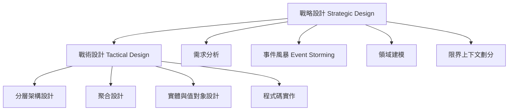
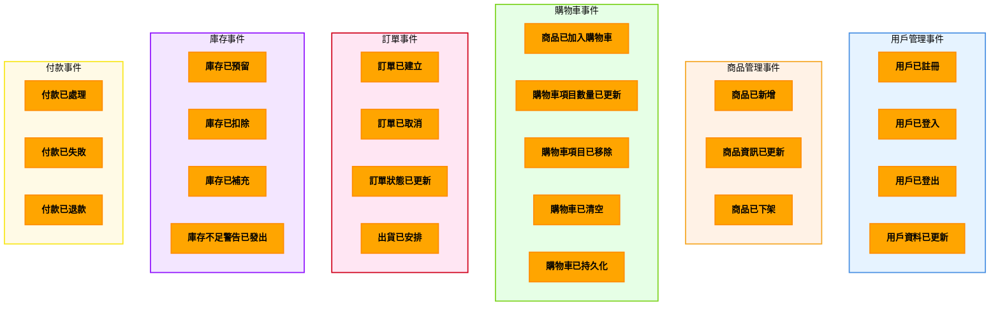
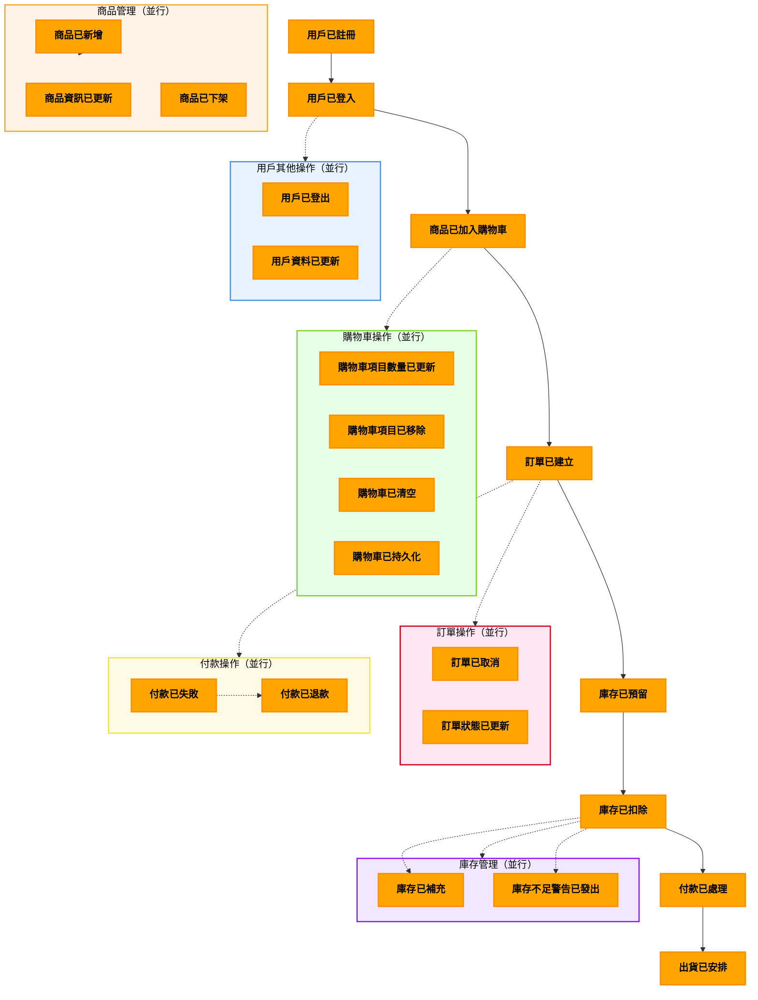
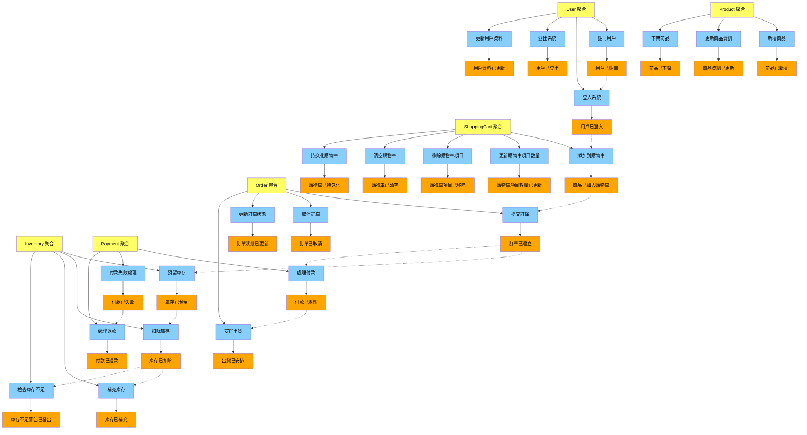
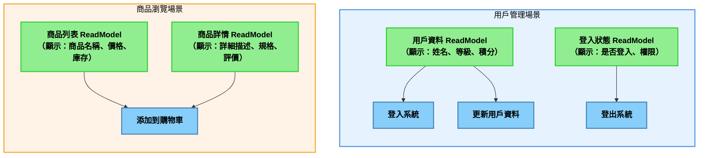
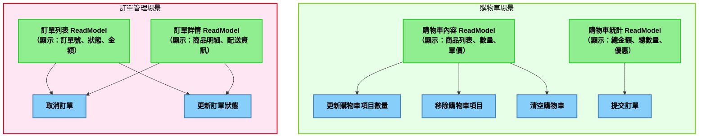
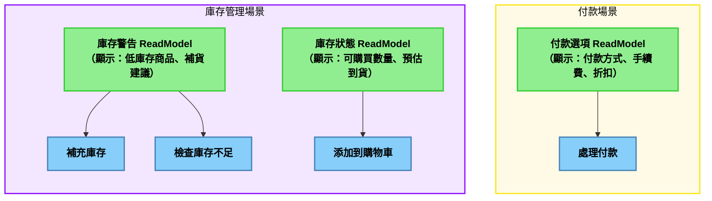
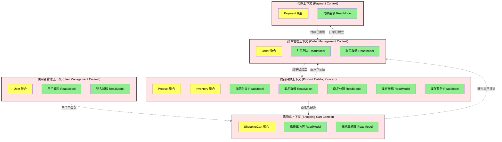

# 領域驅動設計 (DDD) 實戰專案：木葉村忍具店

> **學習目標**：通過實際案例深入理解和實踐 Domain-Driven Design (DDD) 的核心概念與設計模式

## 專案簡介

本專案是一個基於 **領域驅動設計 (Domain-Driven Design, DDD)** 的實戰學習專案，通過設計和實作一個「木葉村忍具店」電商系統，來展示 DDD 的完整開發流程和設計思維。

### 為什麼選擇 DDD？

**DDD 的核心價值**：
- **促進溝通**：建立領域專家與開發團隊間的共通語言 (Ubiquitous Language)
- **聚焦核心業務**：將複雜的業務邏輯清晰地映射到程式碼中
- **保護業務邏輯**：避免技術細節污染領域模型
- **易於維護擴展**：清晰的邊界與職責分離使系統更容易應對變化
- **便於測試**：良好的模組化設計天然支持單元測試

### DDD 設計流程

我們將按照 DDD 的標準流程進行設計與實作：


```mermaid
graph TD
    A[戰略設計 Strategic Design] --> B[戰術設計 Tactical Design]
    A --> A1[需求分析]
    A --> A2[事件風暴 Event Storming]
    A --> A3[領域建模]
    A --> A4[限界上下文劃分]
    B --> B1[分層架構設計]
    B --> B2[聚合設計]
    B --> B3[實體與值對象設計]
    B --> B4[程式碼實作]
```

---

## 專案主題：木葉村忍具店

### 業務背景
木葉村是火之國最大的忍者村落，村內忍者眾多，對各種忍具有著龐大的需求。我們要為木葉村設計一個現代化的忍具電商平台，滿足從下忍到火影等各階層忍者的購物需求。

### 為什麼選擇這個主題？
1. **業務複雜度適中**：涵蓋用戶管理、商品管理、購物車、訂單等核心電商功能
2. **角色多樣性**：不同等級的忍者有不同的購買權限和需求
3. **易於理解**：大家都熟悉的動漫背景，便於建立共通語言
4. **擴展性強**：可以逐步增加積分系統、定制忍具等高級功能

---

## 第一階段：戰略設計 (Strategic Design)

> 戰略設計的目標：**獲得領域知識**，**拆分問題域**，**定義解決方案邊界**

### 一、需求分析 (Requirement Analysis)

#### 核心功能需求

**用戶管理子領域**
- 忍者註冊與身份驗證
- 角色權限管理（下忍、中忍、上忍、特別上忍、火影等）
- 個人資料管理

**商品管理子領域**  
- 忍具分類管理（武器、防具、卷軸、藥品等）
- 商品詳細資訊（價格、描述、庫存、等級限制）
- 商品上下架管理

**購物車子領域**
- 商品加入購物車
- 購物車數量調整
- 購物車狀態持久化

**訂單管理子領域**
- 訂單創建與狀態追蹤
- 支付處理（里程、現金、積分等）
- 訂單歷史查詢

**庫存管理子領域**
- 實時庫存追蹤
- 自動補貨提醒
- 供應商管理

#### 子領域優先級分析

根據 DDD 理論，我們將子領域分為三類：

**核心子領域 (Core Subdomain)**
- **購物車管理**：直接影響用戶購買體驗的核心流程
- **訂單處理**：電商系統的核心價值所在

**支援子領域 (Supporting Subdomain)**  
- **用戶管理**：必要但非差異化的功能
- **商品管理**：支持核心業務但相對標準化

**一般子領域 (Generic Subdomain)**
- **庫存管理**：市場上有成熟解決方案
- **支付處理**：可以使用第三方服務

> **DDD 原則**：將有限的資源集中在核心子領域，支援子領域簡化實作，一般子領域考慮外包或採用現成方案。

### 二、事件風暴 (Event Storming)

#### 什麼是事件風暴？
事件風暴是一種**快速領域建模技術**，通過團隊協作的方式，識別出系統中的關鍵業務事件、命令、聚合等要素。它是 DDD 中最重要的協作工具，能幫助開發團隊和領域專家建立共同的理解。

#### 事件風暴執行步驟

**準備階段**
1. **參與人員**：領域專家、產品經理、架構師、開發人員、測試人員
2. **工具準備**：大白板、便利貼（橘色、藍色、黃色、粉紅色、綠色）、筆
3. **時間安排**：2-4 小時的連續時間，避免中斷

**執行流程**

**第一步：收集領域事件 (橘色便利貼)**
- **目標**：識別業務流程中發生的重要事件
- **方式**：參與者自由發揮，將想到的事件寫在橘色便利貼上
- **命名規則**：使用過去式，例如「用戶已註冊」、「商品已添加到購物車」


```mermaid
flowchart TD
  %% 定義統一的樣式
  classDef eventStyle fill:#FFA500,stroke:#FF8C00,stroke-width:2px,color:#000,font-weight:bold
  %% 用戶管理事件組
  subgraph UserEvents ["用戶管理事件"]
    direction LR
    E1["用戶已註冊"]:::eventStyle
    E2["用戶已登入"]:::eventStyle 
    E3["用戶已登出"]:::eventStyle
    E4["用戶資料已更新"]:::eventStyle
  end

  %% 商品管理事件組
  subgraph ProductEvents ["商品管理事件"]
    direction LR
    E5["商品已新增"]:::eventStyle
    E6["商品資訊已更新"]:::eventStyle
    E7["商品已下架"]:::eventStyle
  end

  %% 購物車事件組
  subgraph CartEvents ["購物車事件"]
    direction LR
    E8["商品已加入購物車"]:::eventStyle
    E9["購物車項目數量已更新"]:::eventStyle
    E10["購物車項目已移除"]:::eventStyle
    E11["購物車已清空"]:::eventStyle
    E12["購物車已持久化"]:::eventStyle
  end

  %% 訂單事件組
  subgraph OrderEvents ["訂單事件"]
    direction LR
    E13["訂單已建立"]:::eventStyle
    E14["訂單已取消"]:::eventStyle
    E15["訂單狀態已更新"]:::eventStyle
    E23["出貨已安排"]:::eventStyle
  end

  %% 庫存事件組
  subgraph InventoryEvents ["庫存事件"]
    direction LR
    E16["庫存已預留"]:::eventStyle
    E17["庫存已扣除"]:::eventStyle
    E18["庫存已補充"]:::eventStyle
    E19["庫存不足警告已發出"]:::eventStyle
  end

  %% 付款事件組
  subgraph PaymentEvents ["付款事件"]
    direction LR
    E20["付款已處理"]:::eventStyle
    E21["付款已失敗"]:::eventStyle
    E22["付款已退款"]:::eventStyle
  end
  %% 分組樣式定義
  style UserEvents fill:#E6F3FF,stroke:#4A90E2,stroke-width:2px,color:#000
  style ProductEvents fill:#FFF2E6,stroke:#F5A623,stroke-width:2px,color:#000
  style CartEvents fill:#E6FFE6,stroke:#7ED321,stroke-width:2px,color:#000
  style OrderEvents fill:#FFE6F3,stroke:#D0021B,stroke-width:2px,color:#000
  style InventoryEvents fill:#F3E6FF,stroke:#9013FE,stroke-width:2px,color:#000
  style PaymentEvents fill:#FFFAE6,stroke:#F8E71C,stroke-width:2px,color:#000
```

**第二步：建立時間線**
- **目標**：將事件按照時間順序排列
- **方式**：團隊討論，將便利貼貼在白板上按時間線排序
- **注意**：可能會有並行流程和分支


```mermaid
flowchart TD
  %% 定義樣式
  classDef eventStyle fill:#FFA500,stroke:#FF8C00,stroke-width:2px,color:#000,font-weight:bold
  classDef primaryFlow stroke:#2196F3,stroke-width:3px
  classDef parallelFlow stroke:#FF9800,stroke-width:2px,stroke-dasharray: 5 5

  %% 主要業務流程（縱向主線）
  E1["用戶已註冊"]:::eventStyle
  E2["用戶已登入"]:::eventStyle
  E8["商品已加入購物車"]:::eventStyle
  E13["訂單已建立"]:::eventStyle
  E16["庫存已預留"]:::eventStyle
  E17["庫存已扣除"]:::eventStyle
  E20["付款已處理"]:::eventStyle
  E23["出貨已安排"]:::eventStyle

  %% 主流程連接
  E1 --> E2 --> E8 --> E13 --> E16 --> E17 --> E20 --> E23
  %% 購物車相關並行流程
  subgraph CartOperations ["購物車操作（並行）"]
    direction LR
    E9["購物車項目數量已更新"]:::eventStyle
    E10["購物車項目已移除"]:::eventStyle
    E11["購物車已清空"]:::eventStyle
    E12["購物車已持久化"]:::eventStyle
  end

  %% 訂單相關並行流程
  subgraph OrderOperations ["訂單操作（並行）"]
    direction LR
    E14["訂單已取消"]:::eventStyle
    E15["訂單狀態已更新"]:::eventStyle
  end

  %% 付款相關並行流程
  subgraph PaymentOperations ["付款操作（並行）"]
    direction LR
    E21["付款已失敗"]:::eventStyle
    E22["付款已退款"]:::eventStyle
  end

  %% 庫存管理並行流程
  subgraph InventoryOperations ["庫存管理（並行）"]
    direction LR
    E18["庫存已補充"]:::eventStyle
    E19["庫存不足警告已發出"]:::eventStyle
  end

  %% 商品管理並行流程
  subgraph ProductOperations ["商品管理（並行）"]
    direction LR
    E5["商品已新增"]:::eventStyle
    E6["商品資訊已更新"]:::eventStyle
    E7["商品已下架"]:::eventStyle
  end

  %% 用戶其他操作
  subgraph UserOperations ["用戶其他操作（並行）"]
    direction LR
    E3["用戶已登出"]:::eventStyle
    E4["用戶資料已更新"]:::eventStyle
  end

  %% 並行流程連接（虛線表示）
  E8 -.-> CartOperations
  E13 -.-> OrderOperations
  E13 -.-> PaymentOperations
  E17 -.-> InventoryOperations
  E2 -.-> UserOperations
  E5 -.-> ProductOperations

  %% 異常處理流程
  E21 -.-> E22
  E17 -.-> E18
  E17 -.-> E19
  %% 分組樣式
  style CartOperations fill:#E6FFE6,stroke:#7ED321,stroke-width:2px,color:#000
  style OrderOperations fill:#FFE6F3,stroke:#D0021B,stroke-width:2px,color:#000
  style PaymentOperations fill:#FFFAE6,stroke:#F8E71C,stroke-width:2px,color:#000
  style InventoryOperations fill:#F3E6FF,stroke:#9013FE,stroke-width:2px,color:#000
  style ProductOperations fill:#FFF2E6,stroke:#F5A623,stroke-width:2px,color:#000
  style UserOperations fill:#E6F3FF,stroke:#4A90E2,stroke-width:2px,color:#000
```

**第三步：添加命令 (藍色便利貼)**
- **目標**：識別觸發事件的用戶意圖或系統操作
- **方式**：在每個事件前面放置對應的命令
- **命名規則**：使用動詞，例如「註冊用戶」、「添加到購物車」


```mermaid
flowchart LR
  %% 定義樣式
  classDef commandStyle fill:#87CEFA,stroke:#4682B4,stroke-width:2px,color:#000,font-weight:bold
  classDef eventStyle fill:#FFA500,stroke:#FF8C00,stroke-width:2px,color:#000,font-weight:bold
  classDef flowLine stroke:#2196F3,stroke-width:3px
  classDef eventFlow stroke:#FF9800,stroke-width:2px,stroke-dasharray: 3 3
  %% 用戶管理流程
  subgraph UserFlow ["用戶管理流程"]
    direction TB
    C1["註冊用戶"]:::commandStyle --> E1["用戶已註冊"]:::eventStyle
    C2["登入系統"]:::commandStyle --> E2["用戶已登入"]:::eventStyle
    C3["登出系統"]:::commandStyle --> E3["用戶已登出"]:::eventStyle
    C4["更新用戶資料"]:::commandStyle --> E4["用戶資料已更新"]:::eventStyle
  end

  %% 商品管理流程
  subgraph ProductFlow ["商品管理流程"]
    direction TB
    C5["新增商品"]:::commandStyle --> E5["商品已新增"]:::eventStyle
    C6["更新商品資訊"]:::commandStyle --> E6["商品資訊已更新"]:::eventStyle
    C7["下架商品"]:::commandStyle --> E7["商品已下架"]:::eventStyle
  end

  %% 購物車管理流程
  subgraph CartFlow ["購物車管理流程"]
    direction TB
    C8["添加到購物車"]:::commandStyle --> E8["商品已加入購物車"]:::eventStyle
    C9["更新購物車項目數量"]:::commandStyle --> E9["購物車項目數量已更新"]:::eventStyle
    C10["移除購物車項目"]:::commandStyle --> E10["購物車項目已移除"]:::eventStyle
    C11["清空購物車"]:::commandStyle --> E11["購物車已清空"]:::eventStyle
    C12["持久化購物車"]:::commandStyle --> E12["購物車已持久化"]:::eventStyle
  end

  %% 訂單管理流程
  subgraph OrderFlow ["訂單管理流程"]
    direction TB
    C13["提交訂單"]:::commandStyle --> E13["訂單已建立"]:::eventStyle
    C14["取消訂單"]:::commandStyle --> E14["訂單已取消"]:::eventStyle
    C15["更新訂單狀態"]:::commandStyle --> E15["訂單狀態已更新"]:::eventStyle
    C23["安排出貨"]:::commandStyle --> E23["出貨已安排"]:::eventStyle
  end

  %% 庫存管理流程
  subgraph InventoryFlow ["庫存管理流程"]
    direction TB
    C16["預留庫存"]:::commandStyle --> E16["庫存已預留"]:::eventStyle
    C17["扣除庫存"]:::commandStyle --> E17["庫存已扣除"]:::eventStyle
    C18["補充庫存"]:::commandStyle --> E18["庫存已補充"]:::eventStyle
    C19["檢查庫存不足"]:::commandStyle --> E19["庫存不足警告已發出"]:::eventStyle
  end

  %% 付款管理流程
  subgraph PaymentFlow ["付款管理流程"]
    direction TB
    C20["處理付款"]:::commandStyle --> E20["付款已處理"]:::eventStyle
    C21["付款失敗處理"]:::commandStyle --> E21["付款已失敗"]:::eventStyle
    C22["處理退款"]:::commandStyle --> E22["付款已退款"]:::eventStyle
  end

  %% 跨流程事件驅動通信（虛線表示）
  E1 -.->|觸發| C2
  E2 -.->|觸發| C8
  E8 -.->|觸發| C13
  E13 -.->|觸發| C16
  E16 -.->|觸發| C17
  E13 -.->|觸發| C20
  E20 -.->|觸發| C23
  E21 -.->|觸發| C22
  E17 -.->|觸發| C18
  E17 -.->|觸發| C19
  %% 分組樣式
  style UserFlow fill:#E6F3FF,stroke:#4A90E2,stroke-width:2px,color:#000
  style ProductFlow fill:#FFF2E6,stroke:#F5A623,stroke-width:2px,color:#000
  style CartFlow fill:#E6FFE6,stroke:#7ED321,stroke-width:2px,color:#000
  style OrderFlow fill:#FFE6F3,stroke:#D0021B,stroke-width:2px,color:#000
  style InventoryFlow fill:#F3E6FF,stroke:#9013FE,stroke-width:2px,color:#000
  style PaymentFlow fill:#FFFAE6,stroke:#F8E71C,stroke-width:2px,color:#000
```

**第四步：識別聚合 (黃色便利貼)**
- **目標**：找出處理命令和產生事件的業務概念
- **方式**：將相關的命令和事件群組化，識別負責處理的聚合
- **原則**：一個聚合負責一組相關的業務邏輯


```mermaid
graph TB
  %% ==== 聚合（黃色） ==== 
  style A1 fill:#FFFF66,color:#000
  style A2 fill:#FFFF66,color:#000
  style A3 fill:#FFFF66,color:#000
  style A4 fill:#FFFF66,color:#000
  style A5 fill:#FFFF66,color:#000
  style A6 fill:#FFFF66,color:#000

  %% ==== 命令（藍色） ==== 
  style C1 fill:#87CEFA,color:#000
  style C2 fill:#87CEFA,color:#000
  style C3 fill:#87CEFA,color:#000
  style C4 fill:#87CEFA,color:#000
  style C5 fill:#87CEFA,color:#000
  style C6 fill:#87CEFA,color:#000
  style C7 fill:#87CEFA,color:#000
  style C8 fill:#87CEFA,color:#000
  style C9 fill:#87CEFA,color:#000
  style C10 fill:#87CEFA,color:#000
  style C11 fill:#87CEFA,color:#000
  style C12 fill:#87CEFA,color:#000
  style C13 fill:#87CEFA,color:#000
  style C14 fill:#87CEFA,color:#000
  style C15 fill:#87CEFA,color:#000
  style C16 fill:#87CEFA,color:#000
  style C17 fill:#87CEFA,color:#000
  style C18 fill:#87CEFA,color:#000
  style C19 fill:#87CEFA,color:#000
  style C20 fill:#87CEFA,color:#000
  style C21 fill:#87CEFA,color:#000
  style C22 fill:#87CEFA,color:#000
  style C23 fill:#87CEFA,color:#000

  %% ==== 事件（橘色） ==== 
  style E1 fill:#FFA500,color:#000
  style E2 fill:#FFA500,color:#000
  style E3 fill:#FFA500,color:#000
  style E4 fill:#FFA500,color:#000
  style E5 fill:#FFA500,color:#000
  style E6 fill:#FFA500,color:#000
  style E7 fill:#FFA500,color:#000
  style E8 fill:#FFA500,color:#000
  style E9 fill:#FFA500,color:#000
  style E10 fill:#FFA500,color:#000
  style E11 fill:#FFA500,color:#000
  style E12 fill:#FFA500,color:#000
  style E13 fill:#FFA500,color:#000
  style E14 fill:#FFA500,color:#000
  style E15 fill:#FFA500,color:#000
  style E16 fill:#FFA500,color:#000
  style E17 fill:#FFA500,color:#000
  style E18 fill:#FFA500,color:#000
  style E19 fill:#FFA500,color:#000
  style E20 fill:#FFA500,color:#000
  style E21 fill:#FFA500,color:#000
  style E22 fill:#FFA500,color:#000
  style E23 fill:#FFA500,color:#000

  %% ==== 聚合定義 ==== 
  A1[User 聚合]
  A2[Product 聚合]
  A3[ShoppingCart 聚合]
  A4[Order 聚合]
  A5[Inventory 聚合]
  A6[Payment 聚合]

  %% ==== User 聚合的責任 ==== 
  A1 --> C1[註冊用戶] --> E1[用戶已註冊]
  A1 --> C2[登入系統] --> E2[用戶已登入]
  A1 --> C3[登出系統] --> E3[用戶已登出]
  A1 --> C4[更新用戶資料] --> E4[用戶資料已更新]

  %% ==== Product 聚合的責任 ==== 
  A2 --> C5[新增商品] --> E5[商品已新增]
  A2 --> C6[更新商品資訊] --> E6[商品資訊已更新]
  A2 --> C7[下架商品] --> E7[商品已下架]

  %% ==== ShoppingCart 聚合的責任 ==== 
  A3 --> C8[添加到購物車] --> E8[商品已加入購物車]
  A3 --> C9[更新購物車項目數量] --> E9[購物車項目數量已更新]
  A3 --> C10[移除購物車項目] --> E10[購物車項目已移除]
  A3 --> C11[清空購物車] --> E11[購物車已清空]
  A3 --> C12[持久化購物車] --> E12[購物車已持久化]

  %% ==== Order 聚合的責任 ==== 
  A4 --> C13[提交訂單] --> E13[訂單已建立]
  A4 --> C14[取消訂單] --> E14[訂單已取消]
  A4 --> C15[更新訂單狀態] --> E15[訂單狀態已更新]
  A4 --> C23[安排出貨] --> E23[出貨已安排]

  %% ==== Inventory 聚合的責任 ==== 
  A5 --> C16[預留庫存] --> E16[庫存已預留]
  A5 --> C17[扣除庫存] --> E17[庫存已扣除]
  A5 --> C18[補充庫存] --> E18[庫存已補充]
  A5 --> C19[檢查庫存不足] --> E19[庫存不足警告已發出]

  %% ==== Payment 聚合的責任 ==== 
  A6 --> C20[處理付款] --> E20[付款已處理]
  A6 --> C21[付款失敗處理] --> E21[付款已失敗]
  A6 --> C22[處理退款] --> E22[付款已退款]

  %% ==== 跨聚合事件驅動通信（虛線表示） ==== 
  E1 -.-> C2
  E2 -.-> C8
  E8 -.-> C13
  E13 -.-> C16
  E16 -.-> C17
  E13 -.-> C20
  E20 -.-> C23
  E21 -.-> C22
  E17 -.-> C18
  E17 -.-> C19
```

**第五步：找出閱讀模型 (綠色便利貼)**
- **目標**：識別用戶需要查看的數據視圖
- **方式**：討論用戶在執行命令前需要看到什麼資訊

**前台用戶操作場景**


```mermaid
flowchart TD
  %% 定義樣式
  classDef readModelStyle fill:#90EE90,stroke:#32CD32,stroke-width:2px,color:#000,font-weight:bold
  classDef commandStyle fill:#87CEFA,stroke:#4682B4,stroke-width:2px,color:#000,font-weight:bold
  
  %% 用戶與商品瀏覽場景
  subgraph UserContext ["用戶管理場景"]
    direction TB
    R1["用戶資料 ReadModel<br/>（顯示：姓名、等級、積分）"]:::readModelStyle
    R2["登入狀態 ReadModel<br/>（顯示：是否登入、權限）"]:::readModelStyle
    
    R1 --> C2["登入系統"]:::commandStyle
    R1 --> C4["更新用戶資料"]:::commandStyle
    R2 --> C3["登出系統"]:::commandStyle
  end

  subgraph ProductContext ["商品瀏覽場景"]
    direction TB
    R3["商品列表 ReadModel<br/>（顯示：商品名稱、價格、庫存）"]:::readModelStyle
    R4["商品詳情 ReadModel<br/>（顯示：詳細描述、規格、評價）"]:::readModelStyle
    
    R3 --> C8["添加到購物車"]:::commandStyle
    R4 --> C8
  end
  
  %% 分組樣式
  style UserContext fill:#E6F3FF,stroke:#4A90E2,stroke-width:2px,color:#000
  style ProductContext fill:#FFF2E6,stroke:#F5A623,stroke-width:2px,color:#000
```

**購物車與訂單管理場景**


```mermaid
flowchart TD
  %% 定義樣式
  classDef readModelStyle fill:#90EE90,stroke:#32CD32,stroke-width:2px,color:#000,font-weight:bold
  classDef commandStyle fill:#87CEFA,stroke:#4682B4,stroke-width:2px,color:#000,font-weight:bold
  
  %% 購物車場景
  subgraph CartContext ["購物車場景"]
    direction TB
    R6["購物車內容 ReadModel<br/>（顯示：商品列表、數量、單價）"]:::readModelStyle
    R7["購物車統計 ReadModel<br/>（顯示：總金額、總數量、優惠）"]:::readModelStyle
    
    R6 --> C9["更新購物車項目數量"]:::commandStyle
    R6 --> C10["移除購物車項目"]:::commandStyle
    R6 --> C11["清空購物車"]:::commandStyle
    R7 --> C13["提交訂單"]:::commandStyle
  end

  %% 訂單管理場景
  subgraph OrderContext ["訂單管理場景"]
    direction TB
    R8["訂單列表 ReadModel<br/>（顯示：訂單號、狀態、金額）"]:::readModelStyle
    R9["訂單詳情 ReadModel<br/>（顯示：商品明細、配送資訊）"]:::readModelStyle
    
    R8 --> C14["取消訂單"]:::commandStyle
    R8 --> C15["更新訂單狀態"]:::commandStyle
    R9 --> C14
    R9 --> C15
  end
  
  %% 分組樣式
  style CartContext fill:#E6FFE6,stroke:#7ED321,stroke-width:2px,color:#000
  style OrderContext fill:#FFE6F3,stroke:#D0021B,stroke-width:2px,color:#000
```

**系統管理場景**


```mermaid
flowchart TD
  %% 定義樣式
  classDef readModelStyle fill:#90EE90,stroke:#32CD32,stroke-width:2px,color:#000,font-weight:bold
  classDef commandStyle fill:#87CEFA,stroke:#4682B4,stroke-width:2px,color:#000,font-weight:bold
  
  %% 付款與庫存場景
  subgraph PaymentContext ["付款場景"]
    direction TB
    R12["付款選項 ReadModel<br/>（顯示：付款方式、手續費、折扣）"]:::readModelStyle
    
    R12 --> C20["處理付款"]:::commandStyle
  end

  subgraph InventoryContext ["庫存管理場景"]
    direction TB
    R11["庫存警告 ReadModel<br/>（顯示：低庫存商品、補貨建議）"]:::readModelStyle
    R10["庫存狀態 ReadModel<br/>（顯示：可購買數量、預估到貨）"]:::readModelStyle
    
    R11 --> C18["補充庫存"]:::commandStyle
    R11 --> C19["檢查庫存不足"]:::commandStyle
    R10 --> C8["添加到購物車"]:::commandStyle
  end
  
  %% 分組樣式
  style PaymentContext fill:#FFFAE6,stroke:#F8E71C,stroke-width:2px,color:#000
  style InventoryContext fill:#F3E6FF,stroke:#9013FE,stroke-width:2px,color:#000
```

**第六步：劃分限界上下文 (粉紅色便利貼)**
- **目標**：將聚合按照業務邊界分組
- **方式**：討論哪些聚合應該在同一個上下文中


```mermaid
graph TB

  %% ==== 聚合（黃色） ==== 
  style A1 fill:#FFFF66,color:#000
  style A2 fill:#FFFF66,color:#000
  style A3 fill:#FFFF66,color:#000
  style A4 fill:#FFFF66,color:#000
  style A5 fill:#FFFF66,color:#000
  style A6 fill:#FFFF66,color:#000

  A1[User 聚合]
  A2[Product 聚合]
  A3[ShoppingCart 聚合]
  A4[Order 聚合]
  A5[Inventory 聚合]
  A6[Payment 聚合]

  %% ==== ReadModel（綠色） ==== 
  style R1 fill:#90EE90,color:#000
  style R2 fill:#90EE90,color:#000
  style R3 fill:#90EE90,color:#000
  style R4 fill:#90EE90,color:#000
  style R5 fill:#90EE90,color:#000
  style R6 fill:#90EE90,color:#000
  style R7 fill:#90EE90,color:#000
  style R8 fill:#90EE90,color:#000
  style R9 fill:#90EE90,color:#000
  style R10 fill:#90EE90,color:#000
  style R11 fill:#90EE90,color:#000
  style R12 fill:#90EE90,color:#000

  R1[用戶資料 ReadModel]
  R2[登入狀態 ReadModel]
  R3[商品列表 ReadModel]
  R4[商品詳情 ReadModel]
  R5[商品分類 ReadModel]
  R6[購物車內容 ReadModel]
  R7[購物車統計 ReadModel]
  R8[訂單列表 ReadModel]
  R9[訂單詳情 ReadModel]
  R10[庫存狀態 ReadModel]
  R11[庫存警告 ReadModel]
  R12[付款選項 ReadModel]

  %% ==== 限界上下文（分組顯示） ==== 
  subgraph UserManagementContext ["使用者管理上下文 (User Management Context)"]
    direction TB
    A1
    R1
    R2
  end

  subgraph ProductCatalogContext ["商品目錄上下文 (Product Catalog Context)"]
    direction TB
    A2
    A5
    R3
    R4
    R5
    R10
    R11
  end

  subgraph ShoppingCartContext ["購物車上下文 (Shopping Cart Context)"]
    direction TB
    A3
    R6
    R7
  end

  subgraph OrderManagementContext ["訂單管理上下文 (Order Management Context)"]
    direction TB
    A4
    R8
    R9
  end

  subgraph PaymentContext ["付款上下文 (Payment Context)"]
    direction TB
    A6
    R12
  end

  %% ==== 跨限界上下文的事件驅動通信（虛線） ==== 
  UserManagementContext -.->|用戶已登入| ShoppingCartContext
  ProductCatalogContext -.->|商品已新增| ShoppingCartContext
  ShoppingCartContext -.->|購物車已提交| OrderManagementContext
  OrderManagementContext -.->|訂單已建立| ProductCatalogContext
  OrderManagementContext -.->|訂單已建立| PaymentContext
  ProductCatalogContext -.->|庫存已扣除| OrderManagementContext
  PaymentContext -.->|付款已處理| OrderManagementContext
  %% ==== 上下文職責說明 ==== 
  classDef contextStyle fill:#FFE4E6,stroke:#333,stroke-width:2px,color:#000

  UserManagementContext:::contextStyle
  ProductCatalogContext:::contextStyle
  ShoppingCartContext:::contextStyle
  OrderManagementContext:::contextStyle
  PaymentContext:::contextStyle
  
  %% 確保 subgraph 標題為黑色
  style UserManagementContext color:#000
  style ProductCatalogContext color:#000
  style ShoppingCartContext color:#000
  style OrderManagementContext color:#000
  style PaymentContext color:#000
```

#### 限界上下文劃分原則與說明

**使用者管理上下文 (User Management Context)**
- **職責**：用戶註冊、登入、身份驗證、資料管理
- **聚合**：User 聚合
- **ReadModel**：用戶資料、登入狀態
- **邊界理由**：用戶管理是獨立的業務能力，與其他業務邏輯關聯較少

**商品目錄上下文 (Product Catalog Context)**
- **職責**：商品資訊管理、庫存管理、商品分類
- **聚合**：Product 聚合、Inventory 聚合
- **ReadModel**：商品列表、商品詳情、商品分類、庫存狀態、庫存警告
- **邊界理由**：商品與庫存密切相關，且共同服務於商品展示與管理

**購物車上下文 (Shopping Cart Context)**
- **職責**：購物車狀態管理、購物車持久化
- **聚合**：ShoppingCart 聚合
- **ReadModel**：購物車內容、購物車統計
- **邊界理由**：購物車是核心業務邏輯，具有獨特的狀態管理需求

**訂單管理上下文 (Order Management Context)**
- **職責**：訂單創建、狀態跟蹤、出貨安排
- **聚合**：Order 聚合
- **ReadModel**：訂單列表、訂單詳情
- **邊界理由**：訂單管理涉及複雜的狀態變化和業務流程

**付款上下文 (Payment Context)**
- **職責**：付款處理、退款、付款狀態管理
- **聚合**：Payment 聚合  
- **ReadModel**：付款選項
- **邊界理由**：付款邏輯複雜且可能整合外部服務，獨立上下文便於管理

#### 本專案事件風暴模擬

**參與角色設定**
- **產品經理**：「我們需要一個忍具購物平台，讓忍者可以方便購買所需裝備」
- **領域專家**：「忍者購買忍具有等級限制，不同等級忍者可購買的商品不同」
- **架構師**：「需要考慮高併發下的庫存一致性問題」
- **開發人員**：「購物車數據如何持久化？用戶離線後再上線購物車還在嗎？」

**討論重點記錄**
1. **產品經理**：「用戶可以不登入就瀏覽商品，但必須登入才能加入購物車」
2. **領域專家**：「購物車應該在用戶登入時自動載入之前的商品」
3. **架構師**：「購物車和訂單是不同的概念，結帳時從購物車創建訂單」
4. **開發人員**：「需要考慮用戶在多個設備上的購物車同步問題」
5. **領域專家**：「庫存扣減必須在訂單確認時進行，不能在加入購物車時扣減」
6. **架構師**：「不同聚合間的通信應該通過領域事件進行，避免直接調用」

#### 我們的事件風暴結果

**完整的領域事件識別**
```
用戶管理事件：
- 用戶已註冊 → 用戶已登入 → 用戶已登出 → 用戶資料已更新

商品管理事件：
- 商品已新增 → 商品資訊已更新 → 商品已下架

購物車事件：
- 商品已加入購物車 → 購物車項目數量已更新 → 購物車項目已移除 → 購物車已清空 → 購物車已持久化

訂單事件：
- 訂單已建立 → 訂單已取消 → 訂單狀態已更新 → 出貨已安排

庫存事件：
- 庫存已預留 → 庫存已扣除 → 庫存已補充 → 庫存不足警告已發出

付款事件：
- 付款已處理 → 付款已失敗 → 付款已退款
```

**對應的命令識別**
```
用戶管理命令：
- 註冊用戶 → 登入系統 → 登出系統 → 更新用戶資料

商品管理命令：
- 新增商品 → 更新商品資訊 → 下架商品

購物車命令：
- 添加到購物車 → 更新購物車項目數量 → 移除購物車項目 → 清空購物車 → 持久化購物車

訂單命令：
- 提交訂單 → 取消訂單 → 更新訂單狀態 → 安排出貨

庫存命令：
- 預留庫存 → 扣除庫存 → 補充庫存 → 檢查庫存不足

付款命令：
- 處理付款 → 付款失敗處理 → 處理退款
```

**聚合設計結果**
```
- User 聚合：負責用戶身份與資料管理
- Product 聚合：負責商品資訊管理
- ShoppingCart 聚合：負責購物車狀態管理（核心聚合）
- Order 聚合：負責訂單生命週期管理（核心聚合）
- Inventory 聚合：負責庫存狀態管理
- Payment 聚合：負責付款處理
```

**ReadModel 視圖設計**
```
- 用戶資料 ReadModel、登入狀態 ReadModel
- 商品列表 ReadModel、商品詳情 ReadModel、商品分類 ReadModel
- 購物車內容 ReadModel、購物車統計 ReadModel
- 訂單列表 ReadModel、訂單詳情 ReadModel
- 庫存狀態 ReadModel、庫存警告 ReadModel
- 付款選項 ReadModel
```

**限界上下文劃分結果**
```
- 使用者管理上下文：User 聚合 + 相關 ReadModel
- 商品目錄上下文：Product 聚合 + Inventory 聚合 + 相關 ReadModel
- 購物車上下文：ShoppingCart 聚合 + 相關 ReadModel
- 訂單管理上下文：Order 聚合 + 相關 ReadModel
- 付款上下文：Payment 聚合 + 相關 ReadModel
```

#### 關鍵洞察與設計決策

**重要發現**：
1. **購物車與訂單分離**：購物車是臨時性的願望清單，訂單是確定的交易記錄
2. **聚合邊界清晰**：每個聚合都有明確的業務職責和數據一致性範圍
3. **事件驅動通信**：聚合間通過領域事件進行鬆耦合的通信
4. **用戶體驗考量**：支持匿名瀏覽、登入購物、跨設備同步等場景
5. **庫存一致性**：庫存扣減在訂單確認時進行，避免購物車占用庫存
6. **商品與庫存分離**：Product 負責商品基本資訊，Inventory 負責庫存數量管理

**設計決策**：
- 購物車聚合獨立於訂單聚合，避免緊耦合
- 商品聚合專注於商品資訊管理，庫存邏輯交由 Inventory 聚合
- 用戶聚合只關注身份認證和基本資料，不包含購物行為
- 通過事件實現跨聚合的業務流程協調
- Product 與 Inventory 聚合放在同一限界上下文，因為它們在商品展示時需要緊密配合
- Payment 聚合獨立，便於整合外部付款服務

### 三、限界上下文劃分 (Bounded Context)

基於前述事件風暴的完整分析結果，我們識別出了木葉村忍具店的五個核心限界上下文。這些上下文的劃分遵循了業務領域的自然邊界，確保每個上下文都有明確的職責和通用語言。

#### 木葉村忍具店的限界上下文設計

**核心子領域 (Core Subdomain)** - 紅色邊框
- **購物車上下文 (Shopping Cart Context)**：忍者購物體驗的核心，支持等級權限驗證和忍具選購
- **訂單管理上下文 (Order Management Context)**：忍具交易的完整生命週期，從下單到火影府配送

**支援子領域 (Supporting Subdomain)** - 藍色邊框  
- **商品目錄上下文 (Product Catalog Context)**：忍具資訊管理，包含等級限制、庫存監控
- **使用者管理上下文 (User Management Context)**：忍者身份驗證、等級權限管理

**一般子領域 (Generic Subdomain)** - 綠色邊框
- **付款上下文 (Payment Context)**：整合木葉村錢莊和第三方付款服務

#### 限界上下文的業務價值

**1. 語意邊界與通用語言 (Ubiquitous Language)**

每個上下文都建立了符合木葉村忍具店業務的專有詞彙：

- **購物車上下文**：忍具項目、等級檢查、購買權限、忍具組合
- **訂單上下文**：訂單狀態（已下單、火影核准、配送中、已送達）、配送區域（木葉村內、邊境任務點）
- **商品目錄上下文**：忍具分類（忍者刀、手裡劍、起爆符）、等級限制（下忍、中忍、上忍、火影級）
- **用戶管理上下文**：忍者等級、村民身份、購買權限、任務積分
- **付款上下文**：木葉幣、任務報酬、分期付款

**2. 技術邊界與架構選擇**

根據各上下文的特性選擇合適的技術棧：

```java
// 購物車上下文：高併發讀寫，需要快速響應
- 資料庫：Redis (主) + PostgreSQL (持久化)
- 快取策略：忍者登入時預載購物車
- 特殊需求：支持匿名瀏覽、登入後購物車合併

// 商品目錄上下文：讀多寫少，需要搜尋功能
- 資料庫：PostgreSQL + Elasticsearch
- 快取策略：商品資訊多級快取
- 特殊需求：等級權限過濾、庫存即時更新

// 訂單管理上下文：高一致性要求
- 資料庫：PostgreSQL (ACID 保證)
- 訊息佇列：RabbitMQ (訂單狀態事件)
- 特殊需求：訂單狀態機、配送追蹤
```

**3. 團隊邊界與組織架構**

```
木葉村忍具店開發團隊劃分：

🔴 核心業務團隊 (Core Teams)
├─ 購物車團隊：前端體驗專家 + 後端效能專家
└─ 訂單團隊：業務分析師 + 後端開發 + 配送協調

🔵 支援業務團隊 (Supporting Teams)  
├─ 商品團隊：產品經理 + 庫存管理 + 搜尋優化
└─ 用戶團隊：安全專家 + 身份驗證 + 權限管理

🟢 平台服務團隊 (Platform Teams)
└─ 付款團隊：第三方整合 + 財務對帳 + 風險控制
```

**4. 資料邊界與事件驅動協作**

避免直接資料耦合，通過領域事件實現上下文間的協作：

```java
// 事件驅動的忍具購買流程
1. UserLoginEvent (用戶上下文)
   ↓
2. CartLoadedEvent (購物車上下文)  
   ↓
3. ProductAddedToCartEvent (商品目錄上下文 → 購物車上下文)
   ↓
4. OrderCreatedEvent (購物車上下文 → 訂單上下文)
   ↓
5. InventoryReservedEvent (商品目錄上下文 ← 訂單上下文)
   ↓
6. PaymentProcessedEvent (付款上下文 → 訂單上下文)
   ↓
7. OrderConfirmedEvent (訂單上下文 → 商品目錄上下文)
```

#### 上下文映射關係與防腐層

**核心業務流程的事件鏈**：
```
忍者身份驗證 → 等級權限載入 → 忍具瀏覽 → 購物車管理 → 
訂單建立 → 等級驗證 → 庫存預留 → 付款處理 → 
火影核准 → 忍具配送 → 任務積分更新
```

**防腐層 (Anti-Corruption Layer) 設計原則**：

1. **API 契約標準化**：每個上下文提供 RESTful API 和事件介面
2. **資料轉換隔離**：使用 DTO 和 Mapper 防止內部模型洩漏  
3. **事件版本控制**：支持事件結構演進，保持向後相容
4. **失敗隔離機制**：單一上下文故障不影響其他上下文運作

> **木葉村忍具店的設計原則**：
> - 忍者等級權限是跨上下文的核心概念，但各上下文維護自己的權限視圖
> - 庫存一致性通過事件最終一致性保證，避免分散式鎖
> - 購物車支持匿名用戶，登入後自動合併，提升用戶體驗
> - 訂單需要火影級別核准的高價值忍具有特殊審批流程

---

## 第二階段：戰術設計 (Tactical Design)

> 戰術設計的目標：**在限界上下文內實作具體的業務邏輯**

### 一、分層架構設計

我們採用經典的 DDD 四層架構：

```
┌─────────────────────────┐
│   Interface Layer       │  ← HTTP Controllers, API Models
│  (用戶介面層)            │
├─────────────────────────┤
│   Application Layer     │  ← Application Services, DTOs  
│  (應用層)                │
├─────────────────────────┤
│   Domain Layer          │  ← Entities, Value Objects, Aggregates
│  (領域層)                │
├─────────────────────────┤
│   Infrastructure Layer  │  ← Repositories, External Services
│  (基礎設施層)            │
└─────────────────────────┘
```

#### 各層職責說明

**Interface Layer (介面層)**
```java
@RestController
public class ShoppingCartController {
    // 只負責HTTP請求處理，不包含業務邏輯
    @PostMapping("/add")
    public ResponseEntity<Void> addToCart(@RequestBody AddToCartRequest request) {
        // 委託給應用層處理
        shoppingCartApplicationService.addToCart(token, dto);
        return ResponseEntity.ok().build();
    }
}
```

**Application Layer (應用層)**
```java
@Service
@Transactional
public class ShoppingCartApplicationService {
    // 協調多個領域物件，但不包含業務邏輯
    public void addToCart(String token, AddToCartDto dto) {
        // 1. 驗證用戶身份
        Long userId = jwtUtil.extractUserId(token);
        
        // 2. 獲取商品資訊
        ProductPure product = productRepository.findById(productId);
        
        // 3. 委託給聚合處理業務邏輯
        cart.addProduct(product, quantity);
        
        // 4. 持久化
        shoppingCartRepository.save(cart);
    }
}
```

**Domain Layer (領域層)**
```java
// 聚合根：包含真正的業務邏輯
public class ShoppingCartPure {
    public void addProduct(ProductPure product, int quantity) {
        // 業務規則：檢查商品是否已存在
        Optional<CartItemPure> existingItem = findItemByProductId(product.getId());
        
        if (existingItem.isPresent()) {
            // 累加數量
            existingItem.get().increaseQuantity(quantity);
        } else {
            // 新增項目
            CartItemPure newItem = CartItemPure.create(product, quantity);
            this.items.add(newItem);
        }
    }
}
```

**Infrastructure Layer (基礎設施層)**
```java
@Repository
public class ShoppingCartPureRepositoryImpl implements ShoppingCartPureRepository {
    // 處理技術細節，如數據庫操作
    public Optional<ShoppingCartPure> findByUserId(UserId userId) {
        // JPA 查詢 + 實體映射
        ShoppingCartEntity entity = jpaRepository.findByUserId(userId.getValue());
        return Optional.ofNullable(mapper.toDomain(entity));
    }
}
```

> **關鍵原則**：依賴方向永遠由外向內，內層不依賴外層，這確保了領域層的純潔性。

### 二、聚合設計 (Aggregate Design)

聚合是 DDD 中最重要的戰術模式之一，它定義了**數據一致性的邊界**。

#### 設計原則

1. **聚合根 (Aggregate Root)**：作為聚合的唯一入口，所有對聚合內部的修改都必須通過聚合根
2. **事務邊界**：一個事務只能修改一個聚合，確保資料一致性
3. **引用方式**：聚合間只能通過 ID 引用，不能直接引用對象，避免緊耦合
4. **小聚合**：聚合應該盡可能小，只包含緊密相關的實體和值對象
5. **不變條件**：聚合負責維護內部的業務不變條件（Business Invariants）
6. **領域事件**：聚合根可以發布領域事件來通知其他聚合或系統

#### 實際專案的聚合設計考量

**購物車聚合的設計決策**：
- ✅ **包含 CartItem**：購物車項目與購物車狀態緊密相關，需要同時變更
- ✅ **引用 ProductId**：避免商品變更影響購物車，通過 ID 解耦
- ✅ **引用 UserId**：用戶資訊與購物車操作獨立
- ✅ **計算總金額**：作為聚合內部業務邏輯

**為什麼 Order 不包含 ShoppingCart**：
- 訂單建立後，購物車可以被清空或繼續使用
- 兩者有不同的生命週期和業務規則
- 通過應用服務協調兩個聚合的交互

**聚合大小的權衡**：
```java
// 合適的聚合大小
public class ShoppingCartPure {
    // 聚合根職責：
    // 1. 管理購物車項目
    // 2. 計算總金額
    // 3. 驗證業務規則
    // 4. 發布領域事件
}

// 如果聚合過小（反模式）
public class CartItemAsAggregate {
    // 問題：無法保證購物車整體一致性
    // 無法執行跨項目的業務規則
}

// 如果聚合過大（反模式）  
public class ECommerceSystemAsAggregate {
    // 問題：包含太多職責
    // 事務邊界過大，效能問題
    // 違反單一職責原則
}
```

#### 我們的聚合設計

**ShoppingCart 聚合**
```java
// 聚合根
public class ShoppingCartPure {
    private ShoppingCartId id;           // 聚合唯一標識
    private UserId userId;               // 引用用戶聚合（通過ID）
    private List<CartItemPure> items;    // 聚合內部實體
    private LocalDateTime createdAt;
    private LocalDateTime updatedAt;
    
    // 業務邏輯：添加商品
    public void addProduct(ProductPure product, Integer quantity) {
        if (product == null || quantity == null || quantity <= 0) {
            throw new IllegalArgumentException("Product and quantity must be valid");
        }

        // 檢查商品是否已存在
        Optional<CartItemPure> existingItem = items.stream()
                .filter(item -> item.getProductId().equals(product.getId()))
                .findFirst();

        if (existingItem.isPresent()) {
            // 更新現有項目數量
            CartItemPure item = existingItem.get();
            items.remove(item);
            items.add(item.toBuilder()
                    .quantity(item.getQuantity() + quantity)
                    .build());
        } else {
            // 添加新項目，引用商品聚合（通過ID）
            items.add(CartItemPure.builder()
                    .productId(product.getId())
                    .productName(product.getDetails().getName())
                    .productImageUrl(product.getImageUrl())
                    .quantity(quantity)
                    .unitPrice(product.getPrice().getAmount())
                    .build());
        }
        this.updatedAt = LocalDateTime.now();
    }
    
    // 業務邏輯：移除商品
    public void removeProduct(ProductId productId) {
        items.removeIf(item -> item.getProductId().equals(productId));
        this.updatedAt = LocalDateTime.now();
    }
    
    // 業務邏輯：計算總金額
    public Money getTotalAmount() {
        BigDecimal total = items.stream()
                .map(item -> item.getUnitPrice().multiply(BigDecimal.valueOf(item.getQuantity())))
                .reduce(BigDecimal.ZERO, BigDecimal::add);
        return new Money(total);
    }
    
    // 業務邏輯：清空購物車
    public void clear() {
        this.items.clear();
        this.updatedAt = LocalDateTime.now();
    }
}
```

**User 聚合**
```java
@Value
@Builder(toBuilder = true)
public class UserPure {
    UserId id;
    String username;
    UserProfilePure profile;          // 值對象
    UserCredentialsPure credentials;  // 值對象
    
    // 業務邏輯：更新用戶資訊
    public UserPure updateUserInfo(String username, String fullName, String phoneNumber, 
                                  String address, LocalDate dateOfBirth) {
        if (username == null || username.trim().isEmpty()) {
            throw new IllegalArgumentException("Username cannot be null or empty");
        }

        UserProfilePure updatedProfile = profile.toBuilder()
                .fullName(fullName)
                .phoneNumber(phoneNumber)
                .address(address)
                .dateOfBirth(dateOfBirth)
                .build();

        return this.toBuilder()
                .username(username.trim())
                .profile(updatedProfile)
                .build();
    }
}
```

**Product 聚合**
```java
@Getter
@AllArgsConstructor
@Builder
public class ProductPure {
    private final ProductId id;
    private ProductDetails details;      // 值對象
    private Money price;                // 值對象
    private StockQuantity stockQuantity; // 值對象
    private ProductCategory category;    // 值對象
    private String status;
    private String imageUrl;
    
    // 業務邏輯：檢查是否可購買
    public boolean isAvailable() {
        return "ACTIVE".equals(status) && stockQuantity.isAvailable();
    }
    
    public boolean hasEnoughStock(int requestedQuantity) {
        return stockQuantity.hasEnough(requestedQuantity);
    }
    
    // 業務邏輯：庫存管理
    public void reduceStock(int quantity) {
        if (!hasEnoughStock(quantity)) {
            throw new IllegalArgumentException("Insufficient stock");
        }
        this.stockQuantity = this.stockQuantity.reduce(quantity);
    }
    
    public void updatePrice(Money newPrice) {
        if (newPrice.isNegativeOrZero()) {
            throw new IllegalArgumentException("Price must be positive");
        }
        this.price = newPrice;
    }
}
```

**Order 聚合** (實際專案新增)
```java
@Value
@Builder(toBuilder = true)
public class OrderPure {
    OrderId id;
    UserId userId;                      // 引用用戶聚合（通過ID）
    List<OrderItemPure> items;          // 聚合內部實體
    OrderStatus status;
    BigDecimal totalAmount;
    PaymentInfoPure paymentInfo;        // 值對象
    LocalDateTime createdAt;
    LocalDateTime updatedAt;
    
    // 業務邏輯：取消訂單
    public OrderPure cancel() {
        if (status != OrderStatus.PENDING) {
            throw new IllegalStateException("Only pending orders can be cancelled");
        }
        return this.toBuilder()
                .status(OrderStatus.CANCELLED)
                .updatedAt(LocalDateTime.now())
                .build();
    }
    
    // 業務邏輯：確認付款
    public OrderPure confirmPayment(PaymentInfoPure paymentInfo) {
        return this.toBuilder()
                .status(OrderStatus.PAID)
                .paymentInfo(paymentInfo)
                .updatedAt(LocalDateTime.now())
                .build();
    }
}
```

#### 為什麼這樣設計？

**正確的設計原則**：
- **ShoppingCart 和 CartItem 在同一個聚合內**：因為它們需要保持一致性，購物車項目的變更必須與購物車狀態同步
- **Product 是獨立聚合**：商品資訊變更不應該直接影響購物車，通過 ProductId 引用
- **User 是獨立聚合**：符合單一職責原則，用戶資訊變更與購物車操作解耦
- **Order 是獨立聚合**：訂單有自己的生命週期和業務規則

**實際專案的聚合邊界**：
```
🛒 ShoppingCart 聚合
├── ShoppingCartPure (聚合根)
└── CartItemPure (內部實體)

👤 User 聚合  
├── UserPure (聚合根)
├── UserProfilePure (值對象)
└── UserCredentialsPure (值對象)

📦 Product 聚合
├── ProductPure (聚合根)
├── ProductDetails (值對象)
├── Money (值對象)
├── StockQuantity (值對象)
└── ProductCategory (值對象)

📋 Order 聚合
├── OrderPure (聚合根)
├── OrderItemPure (內部實體)
├── PaymentInfoPure (值對象)
└── OrderStatus (列舉)
```

**錯誤的設計範例**：
```java
// ❌ 錯誤：將其他聚合的實體直接放在聚合內
public class ShoppingCartWrong {
    private List<ProductPure> products;  // 錯誤！跨聚合直接引用
    private UserPure user;              // 錯誤！應該只引用 UserId
}

// ❌ 錯誤：聚合過大，包含太多職責
public class OrderWrong {
    private UserPure user;               // 錯誤！應該只引用 UserId
    private List<ProductPure> products;  // 錯誤！應該只引用 ProductId
    private ShoppingCartPure cart;       // 錯誤！跨聚合直接引用
    private PaymentService paymentService; // 錯誤！服務不應該在聚合內
}

// ✅ 正確：通過 ID 引用，保持聚合邊界
public class OrderCorrect {
    private OrderId id;
    private UserId userId;              // ✅ 只引用 ID
    private List<OrderItemPure> items;  // ✅ 內部實體
    private OrderStatus status;
    private PaymentInfoPure paymentInfo; // ✅ 值對象
}
```

### 三、值對象設計 (Value Object Design)

值對象是描述性的，沒有標識符，且不可變。

#### 核心值對象

**Money (金錢)**
```java
@Value
public class Money {
    BigDecimal amount;
    String currency;
    
    public Money(BigDecimal amount, String currency) {
        if (amount == null) {
            throw new IllegalArgumentException("Amount cannot be null");
        }
        if (currency == null || currency.trim().isEmpty()) {
            throw new IllegalArgumentException("Currency cannot be null or empty");
        }
        this.amount = amount;
        this.currency = currency;
    }
    
    public Money(BigDecimal amount) {
        this(amount, "TWD"); // 預設為台幣
    }
    
    public static Money of(BigDecimal amount) {
        return new Money(amount);
    }
    
    public static Money of(BigDecimal amount, String currency) {
        return new Money(amount, currency);
    }
    
    // 業務邏輯：金額計算
    public boolean isNegativeOrZero() {
        return amount.compareTo(BigDecimal.ZERO) <= 0;
    }
    
    public Money add(Money other) {
        if (!this.currency.equals(other.currency)) {
            throw new IllegalArgumentException("Cannot add different currencies");
        }
        return new Money(this.amount.add(other.amount), this.currency);
    }
    
    public Money multiply(int quantity) {
        return new Money(this.amount.multiply(BigDecimal.valueOf(quantity)), this.currency);
    }
}
```

**強型別 ID**
```java
// 避免原始型別困擾 (Primitive Obsession)
@Value
public class ProductId {
    Long value;
    
    public ProductId(Long value) {
        if (value == null || value <= 0) {
            throw new IllegalArgumentException("Product ID must be positive");
        }
        this.value = value;
    }
    
    public static ProductId of(Long value) {
        return new ProductId(value);
    }
}

// 其他強型別 ID
@Value
public class UserId {
    Long value;
    // 類似實作...
}

@Value
public class ShoppingCartId {
    Long value;
    // 類似實作...
}
```

**ProductDetails (實際專案中的值對象)**
```java
@Value
@Builder
public class ProductDetails {
    String name;
    String description;
    
    // 值對象包含業務驗證邏輯
    public ProductDetails(String name, String description) {
        if (name == null || name.trim().isEmpty()) {
            throw new IllegalArgumentException("商品名稱不能為空");
        }
        if (name.length() > 100) {
            throw new IllegalArgumentException("商品名稱不能超過100字元");
        }
        
        this.name = name.trim();
        this.description = description;
    }
}
```

**StockQuantity (庫存數量值對象)**
```java
@Value
public class StockQuantity {
    Integer value;
    
    public StockQuantity(Integer value) {
        if (value == null || value < 0) {
            throw new IllegalArgumentException("Stock quantity cannot be negative");
        }
        this.value = value;
    }
    
    public boolean isAvailable() {
        return value > 0;
    }
    
    public boolean hasEnough(int requestedQuantity) {
        return value >= requestedQuantity;
    }
    
    public StockQuantity reduce(int quantity) {
        if (quantity > value) {
            throw new IllegalArgumentException("Cannot reduce more than available stock");
        }
        return new StockQuantity(value - quantity);
    }
    
    public StockQuantity adjust(int quantity) {
        return new StockQuantity(value + quantity);
    }
}
```

**UserProfilePure (用戶資料值對象)**
```java
@Value
@Builder(toBuilder = true)
public class UserProfilePure {
    String fullName;
    String email;
    String phoneNumber;
    String address;
    LocalDate dateOfBirth;
    
    // 驗證邏輯在建構時執行
    public UserProfilePure(String fullName, String email, String phoneNumber, 
                          String address, LocalDate dateOfBirth) {
        if (email != null && !isValidEmail(email)) {
            throw new IllegalArgumentException("Invalid email format");
        }
        
        this.fullName = fullName;
        this.email = email;
        this.phoneNumber = phoneNumber;
        this.address = address;
        this.dateOfBirth = dateOfBirth;
    }
    
    private boolean isValidEmail(String email) {
        return email.contains("@") && email.contains(".");
    }
}
```

#### 值對象的重要性

1. **表達業務概念**：`Money` 比 `BigDecimal` 更清楚表達金錢概念
2. **封裝驗證邏輯**：建構時就確保數據有效性
3. **避免原始型別困擾**：`ProductId` 避免了傳錯參數的問題
4. **不可變性**：確保線程安全和數據一致性

### 四、Repository 模式

Repository 提供了一個**面向領域的數據訪問介面**，隱藏了技術細節。

#### Repository 介面設計

```java
// Domain Layer - 純粹的領域介面
public interface ShoppingCartPureRepository {
    Optional<ShoppingCartPure> findById(ShoppingCartId id);
    Optional<ShoppingCartPure> findByUserId(UserId userId);
    ShoppingCartPure save(ShoppingCartPure cart);
    void delete(ShoppingCartPure cart);
    
    // 面向業務的查詢方法，而非技術導向的 CRUD
    List<ShoppingCartPure> findEmptyCartsOlderThan(LocalDateTime threshold);
    boolean existsByUserId(UserId userId);
}
```

#### Repository 實作

```java
// Infrastructure Layer - 技術實作
@Repository
@RequiredArgsConstructor
@Slf4j
public class ShoppingCartPureRepositoryImpl implements ShoppingCartPureRepository {
    
    private final ShoppingCartJpaRepository jpaRepository;
    private final ShoppingCartEntityMapper mapper;
    
    @Override
    @Transactional(readOnly = true)
    public Optional<ShoppingCartPure> findById(ShoppingCartId id) {
        log.debug("Finding shopping cart by id: {}", id.getValue());
        
        return jpaRepository.findByIdWithItems(id.getValue())
                .map(mapper::toDomain);  // 實體映射
    }
    
    @Override
    @Transactional(readOnly = true)
    public Optional<ShoppingCartPure> findByUserId(UserId userId) {
        log.debug("Finding shopping cart by user id: {}", userId.getValue());
        
        return jpaRepository.findByUserIdWithItems(userId.getValue())
                .map(mapper::toDomain);
    }
    
    @Override
    @Transactional
    public ShoppingCartPure save(ShoppingCartPure cart) {
        log.debug("Saving shopping cart: {}", cart.getId());
        
        ShoppingCartEntity entity = mapper.toEntity(cart);
        ShoppingCartEntity savedEntity = jpaRepository.save(entity);
        return mapper.toDomain(savedEntity);
    }
}
```

#### Anti-Corruption Layer (防腐層)

我們使用 Mapper 來隔離領域模型和持久化模型：

```java
@Component
public class ShoppingCartEntityMapper {
    
    // 領域模型 → 持久化模型
    public ShoppingCartEntity toEntity(ShoppingCartPure domain) {
        return ShoppingCartEntity.builder()
            .id(domain.getId() != null ? domain.getId().getValue() : null)
            .userId(domain.getUserId().getValue())
            .items(domain.getItems().stream()
                .map(this::cartItemToEntity)
                .collect(Collectors.toList()))
            .build();
    }
    
    // 持久化模型 → 領域模型
    public ShoppingCartPure toDomain(ShoppingCartEntity entity) {
        return new ShoppingCartPure(
            entity.getId() != null ? ShoppingCartId.of(entity.getId()) : null,
            UserId.of(entity.getUserId()),
            entity.getItems().stream()
                .map(this::cartItemToDomain)
                .collect(Collectors.toList())
        );
    }
}
```

> **防腐層的重要性**：它保護領域模型不被外部技術細節污染，使得我們可以獨立演化領域邏輯和技術實作。

---

## 專案結構

基於 DDD 原則，我們的專案結構如下：

```
src/main/java/com/kai/ninja_ddd_practice/
├── interfaceLayer/                    # 介面層
│   ├── controllers/                   # REST Controllers
│   ├── apiModels/                     # API 請求/回應模型
│   └── mappers/                       # Interface Layer Mappers
├── applicationLayer/                  # 應用層
│   ├── applicationService/            # 應用服務
│   ├── dtos/                         # 數據傳輸物件
│   └── mappers/                       # Application Layer Mappers
├── domainLayer/                       # 領域層 (核心)
│   ├── aggregations/                  # 聚合
│   │   ├── user/
│   │   │   ├── aggregateRoot/         # User 聚合根
│   │   │   └── valueObjects/          # UserId, UserProfile 等
│   │   ├── product/
│   │   │   ├── aggregateRoot/         # Product 聚合根
│   │   │   └── valueObjects/          # ProductId, Money 等
│   │   └── shoppingCart/
│   │       ├── aggregateRoot/         # ShoppingCart 聚合根
│   │       └── valueObjects/          # CartItem 等
│   ├── repositoryInterfaces/          # Repository 介面
│   ├── domainServices/                # 領域服務
│   └── domainEvents/                  # 領域事件
└── infrastructureLayer/               # 基礎設施層
    ├── persistence/                   # 持久化
    │   ├── entities/                  # JPA 實體
    │   ├── repositories/              # JPA Repositories
    │   └── mappers/                   # 實體映射器
    ├── repositoryImplementations/     # Repository 實作
    ├── security/                      # 安全相關
    └── config/                        # 配置類
```

### 目錄職責說明

| 層級 | 職責 | 依賴關係 |
|------|------|----------|
| **Interface** | HTTP 請求處理、資料驗證、格式轉換 | → Application |
| **Application** | 流程協調、事務管理、DTO 轉換 | → Domain |
| **Domain** | 業務邏輯、業務規則、領域知識 | 無外部依賴 |
| **Infrastructure** | 技術實作、外部服務整合 | → Domain (介面) |

> **依賴倒置原則**：高層模組不依賴低層模組，兩者都依賴抽象。Infrastructure 層實作 Domain 層定義的介面。

---

## 數據庫設計

## 數據庫設計

### 設計原則

1. **聚合邊界 = 表邊界**：每個聚合對應到資料庫中的相關表
2. **避免跨聚合外鍵**：聚合間只通過 ID 引用，不建立 FK 約束
3. **值對象內嵌**：將值對象的屬性內嵌到聚合根的表中

### 資料庫 Schema

```sql
-- 用戶聚合
CREATE TABLE users (
    id BIGINT PRIMARY KEY AUTO_INCREMENT,
    username VARCHAR(50) UNIQUE NOT NULL,
    
    -- UserCredentials 值對象內嵌
    hashed_password VARCHAR(255) NOT NULL,
    random_salt VARCHAR(255) NOT NULL,
    last_login_time TIMESTAMP,
    
    -- UserProfile 值對象內嵌
    full_name VARCHAR(100),
    email VARCHAR(100) UNIQUE NOT NULL,
    phone_number VARCHAR(20),
    date_of_birth DATE,
    address TEXT,
    
    created_at TIMESTAMP DEFAULT CURRENT_TIMESTAMP,
    updated_at TIMESTAMP DEFAULT CURRENT_TIMESTAMP ON UPDATE CURRENT_TIMESTAMP
);

-- 商品聚合
CREATE TABLE products (
    id BIGINT PRIMARY KEY AUTO_INCREMENT,
    
    -- ProductDetails 值對象內嵌
    name VARCHAR(100) NOT NULL,
    description TEXT,
    image_url VARCHAR(500),
    
    -- Money 值對象內嵌
    price_amount DECIMAL(10,2) NOT NULL,
    price_currency VARCHAR(3) DEFAULT 'TWD',
    
    stock_quantity INT NOT NULL DEFAULT 0,
    status VARCHAR(20) NOT NULL DEFAULT 'ACTIVE',
    
    created_at TIMESTAMP DEFAULT CURRENT_TIMESTAMP,
    updated_at TIMESTAMP DEFAULT CURRENT_TIMESTAMP ON UPDATE CURRENT_TIMESTAMP
);

-- 購物車聚合
CREATE TABLE shopping_carts (
    id BIGINT PRIMARY KEY AUTO_INCREMENT,
    user_id BIGINT NOT NULL,  -- 引用 User 聚合，但不建立 FK
    
    created_at TIMESTAMP DEFAULT CURRENT_TIMESTAMP,
    updated_at TIMESTAMP DEFAULT CURRENT_TIMESTAMP ON UPDATE CURRENT_TIMESTAMP,
    
    INDEX idx_user_id (user_id)
);

-- 購物車項目 (CartItem 值對象，但因為集合關係獨立成表)
CREATE TABLE cart_items (
    id BIGINT PRIMARY KEY AUTO_INCREMENT,
    cart_id BIGINT NOT NULL,
    product_id BIGINT NOT NULL,  -- 引用 Product 聚合，但不建立 FK
    
    -- 商品快照 (避免商品資訊變更影響購物車)
    product_name VARCHAR(100) NOT NULL,
    unit_price_amount DECIMAL(10,2) NOT NULL,
    unit_price_currency VARCHAR(3) DEFAULT 'TWD',
    
    quantity INT NOT NULL,
    
    created_at TIMESTAMP DEFAULT CURRENT_TIMESTAMP,
    updated_at TIMESTAMP DEFAULT CURRENT_TIMESTAMP ON UPDATE CURRENT_TIMESTAMP,
    
    FOREIGN KEY (cart_id) REFERENCES shopping_carts(id) ON DELETE CASCADE,
    INDEX idx_cart_id (cart_id),
    INDEX idx_product_id (product_id)
);
```

### 為什麼不建立跨聚合外鍵？

**DDD 推薦做法**：
```sql
-- 購物車只引用 User ID，不建立外鍵約束
CREATE TABLE shopping_carts (
    user_id BIGINT NOT NULL,  -- 只是引用，不是 FK
    ...
);
```

**傳統 ORM 做法**：
```sql
-- 錯誤：建立跨聚合外鍵
CREATE TABLE shopping_carts (
    user_id BIGINT NOT NULL,
    FOREIGN KEY (user_id) REFERENCES users(id),  -- 造成緊耦合
    ...
);
```

**原因**：
1. **聚合獨立性**：每個聚合應該能獨立演化
2. **避免分散式事務**：跨聚合操作通過事件而非事務
3. **微服務準備**：未來可以將不同聚合拆分到不同服務

### 資料初始化

```sql
-- 測試資料
INSERT INTO users (username, hashed_password, random_salt, full_name, email) VALUES
('naruto', 'hashed_password_1', 'salt_1', '漩渦鳴人', 'naruto@konoha.village'),
('sasuke', 'hashed_password_2', 'salt_2', '宇智波佐助', 'sasuke@konoha.village'),
('sakura', 'hashed_password_3', 'salt_3', '春野櫻', 'sakura@konoha.village');

INSERT INTO products (name, description, price_amount, price_currency, stock_quantity, status) VALUES
('苦無', '基本忍具，投擲用武器', 150.00, 'TWD', 100, 'PULL_ON_SHELVES'),
('手裏劍', '星型投擲武器，命中率高', 80.00, 'TWD', 200, 'PULL_ON_SHELVES'),
('煙霧彈', '逃跑或掩護用道具', 120.00, 'TWD', 50, 'PULL_ON_SHELVES'),
('兵糧丸', '快速恢復查克拉的藥品', 300.00, 'TWD', 30, 'PULL_ON_SHELVES');
```

---

## 技術棧與配置

### 技術選型

| 層級 | 技術 | 版本 | 說明 |
|------|------|------|------|
| **框架** | Spring Boot | 3.3.1 | 主框架 |
| **語言** | Java | 17 | LTS 版本 |
| **構建工具** | Maven | 3.9+ | 依賴管理 |
| **資料庫** | H2 | 內嵌 | 開發環境快速啟動 |
| **ORM** | Spring Data JPA | 3.3.1 | 資料存取 |
| **安全** | Spring Security + JWT | 6.3.1 | 認證授權 |
| **文檔** | Lombok | 1.18.30 | 減少樣板代碼 |

### 應用程式配置

```yaml
# application.yml
spring:
  application:
    name: ninja-ddd-practice
    
  # H2 內嵌資料庫配置
  datasource:
    url: jdbc:h2:mem:testdb
    driver-class-name: org.h2.Driver
    username: sa
    password: password
    
  # H2 控制台 (開發環境)
  h2:
    console:
      enabled: true
      path: /h2-console
      
  # JPA 配置
  jpa:
    hibernate:
      ddl-auto: update  # 開發環境自動建表
    show-sql: true      # 顯示 SQL (開發環境)
    open-in-view: false # 避免 LazyInitializationException
    generate-ddl: false

# JWT 配置
jwt:
  secret: ninja-ddd-practice-secret-key-for-development
  expiration: 86400000  # 24小時 (毫秒)

# 日誌配置
logging:
  level:
    com.kai.ninja_ddd_practice: DEBUG
    org.springframework.security: DEBUG
    org.springframework.web: DEBUG
```

### Maven 依賴

```xml
<dependencies>
    <!-- Spring Boot Starters -->
    <dependency>
        <groupId>org.springframework.boot</groupId>
        <artifactId>spring-boot-starter-web</artifactId>
    </dependency>
    
    <dependency>
        <groupId>org.springframework.boot</groupId>
        <artifactId>spring-boot-starter-data-jpa</artifactId>
    </dependency>
    
    <dependency>
        <groupId>org.springframework.boot</groupId>
        <artifactId>spring-boot-starter-security</artifactId>
    </dependency>
    
    <dependency>
        <groupId>org.springframework.boot</groupId>
        <artifactId>spring-boot-starter-validation</artifactId>
    </dependency>
    
    <!-- JWT -->
    <dependency>
        <groupId>io.jsonwebtoken</groupId>
        <artifactId>jjwt-api</artifactId>
        <version>0.11.5</version>
    </dependency>
    
    <!-- 資料庫 -->
    <dependency>
        <groupId>com.h2database</groupId>
        <artifactId>h2</artifactId>
        <scope>runtime</scope>
    </dependency>
    
    <!-- 工具 -->
    <dependency>
        <groupId>org.projectlombok</groupId>
        <artifactId>lombok</artifactId>
        <optional>true</optional>
    </dependency>
</dependencies>
```

---

## 實作重點與最佳實踐

### 1. 購物車核心功能實作

#### 添加商品到購物車

```java
@Service
@Transactional
public class ShoppingCartApplicationService {
    
    public void addToCart(String token, AddToCartDto dto) {
        // 1. 身份驗證 (Infrastructure 層的技術細節)
        Long userId = jwtUtil.extractUserId(token);
        
        // 2. 獲取業務物件
        ProductPure product = productRepository.findById(ProductId.of(dto.getProductId()))
            .orElseThrow(() -> new IllegalArgumentException("商品不存在"));
            
        // 3. 業務邏輯委託給聚合
        ShoppingCartPure cart = getOrCreateCart(UserId.of(userId));
        cart.addProduct(product, dto.getQuantity());
        
        // 4. 持久化
        shoppingCartRepository.save(cart);
    }
    
    private ShoppingCartPure getOrCreateCart(UserId userId) {
        return shoppingCartRepository.findByUserId(userId)
            .orElse(new ShoppingCartPure(null, userId));
    }
}
```

#### 聚合內的業務邏輯

```java
public class ShoppingCartPure {
    
    public void addProduct(ProductPure product, int quantity) {
        // 業務規則：檢查商品狀態
        if (!product.isAvailableForPurchase(quantity)) {
            throw new IllegalArgumentException("商品庫存不足或已下架");
        }
        
        // 業務規則：相同商品累加數量
        Optional<CartItemPure> existingItem = findItemByProductId(product.getId());
        if (existingItem.isPresent()) {
            existingItem.get().increaseQuantity(quantity);
        } else {
            // 創建新的購物車項目
            CartItemPure newItem = CartItemPure.create(
                product.getId(),
                product.getDetails().getName(),
                product.getPrice(),
                quantity
            );
            this.items.add(newItem);
        }
    }
    
    // 業務規則：移除商品時的邏輯
    public void removeProduct(ProductId productId) {
        boolean removed = this.items.removeIf(item -> 
            item.getProductId().equals(productId));
            
        if (!removed) {
            // 根據業務需求，這裡可以選擇拋出異常或靜默處理
            log.warn("嘗試移除不存在的商品: {}", productId.getValue());
        }
    }
}
```

### 2. 錯誤處理策略

根據 DDD 原則，不同層級有不同的錯誤處理策略：

```java
// Domain Layer: 業務規則驗證
public class Money {
    private Money(BigDecimal amount, String currency) {
        if (amount.compareTo(BigDecimal.ZERO) < 0) {
            throw new IllegalArgumentException("金額不能為負數");  // 業務規則異常
        }
        this.amount = amount;
        this.currency = currency;
    }
}

// Application Layer: 協調和異常轉換
@Service
public class ShoppingCartApplicationService {
    
    public void addToCart(String token, AddToCartDto dto) {
        try {
            // 委託給領域層處理
            cart.addProduct(product, quantity);
        } catch (IllegalArgumentException e) {
            // 轉換為應用層異常
            throw new ShoppingCartException("添加商品到購物車失敗: " + e.getMessage());
        }
    }
}

// Interface Layer: HTTP 異常處理
@ControllerAdvice
public class GlobalExceptionHandler {
    
    @ExceptionHandler(ShoppingCartException.class)
    public ResponseEntity<ErrorResponse> handleShoppingCartException(ShoppingCartException e) {
        return ResponseEntity.badRequest()
            .body(new ErrorResponse("CART_ERROR", e.getMessage()));
    }
}
```

### 3. 測試策略

DDD 的分層架構天然支持不同層級的測試，我們按照測試金字塔原則實作完整的測試覆蓋：

#### Domain Layer 單元測試

```java
package com.kai.ninja_ddd_practice.domainLayer.aggregations.shoppingCart.aggregateRoot;

import com.kai.ninja_ddd_practice.domainLayer.aggregations.product.aggregateRoot.ProductPure;
import com.kai.ninja_ddd_practice.domainLayer.aggregations.product.valueObjects.ProductId;
import com.kai.ninja_ddd_practice.domainLayer.aggregations.product.valueObjects.ProductDetails;
import com.kai.ninja_ddd_practice.domainLayer.aggregations.product.valueObjects.Money;
import com.kai.ninja_ddd_practice.domainLayer.aggregations.user.valueObjects.UserId;
import com.kai.ninja_ddd_practice.domainLayer.aggregations.shoppingCart.valueObjects.CartItemPure;
import org.junit.jupiter.api.BeforeEach;
import org.junit.jupiter.api.Test;
import org.junit.jupiter.api.DisplayName;

import java.math.BigDecimal;

import static org.assertj.core.api.Assertions.*;

@DisplayName("購物車聚合 - 領域邏輯測試")
class ShoppingCartPureTest {

    private ShoppingCartPure cart;
    private ProductPure testProduct;
    private UserId testUserId;

    @BeforeEach
    void setUp() {
        testUserId = UserId.of(1L);
        cart = new ShoppingCartPure(null, testUserId);
        
        // 建立測試商品
        testProduct = ProductPure.builder()
            .id(ProductId.of(1L))
            .details(ProductDetails.of("苦無", "基本忍具", "kunai.jpg"))
            .price(Money.of(BigDecimal.valueOf(150), "TWD"))
            .stockQuantity(100)
            .status("PULL_ON_SHELVES")
            .build();
    }

    @Test
    @DisplayName("當商品不存在於購物車時，應該新增商品項目")
    void should_add_new_item_when_product_not_exists() {
        // Given
        int quantity = 2;
        
        // When
        cart.addProduct(testProduct, quantity);
        
        // Then
        assertThat(cart.getItems()).hasSize(1);
        CartItemPure addedItem = cart.getItems().get(0);
        assertThat(addedItem.getProductId()).isEqualTo(testProduct.getId());
        assertThat(addedItem.getQuantity()).isEqualTo(quantity);
        assertThat(addedItem.getProductName()).isEqualTo("苦無");
        assertThat(addedItem.getUnitPrice()).isEqualTo(Money.of(BigDecimal.valueOf(150), "TWD"));
    }

    @Test
    @DisplayName("當商品已存在於購物車時，應該累加數量")
    void should_increase_quantity_when_product_already_exists() {
        // Given
        cart.addProduct(testProduct, 2);
        
        // When
        cart.addProduct(testProduct, 3);
        
        // Then
        assertThat(cart.getItems()).hasSize(1);
        assertThat(cart.getItems().get(0).getQuantity()).isEqualTo(5);
    }

    @Test
    @DisplayName("當移除存在的商品時，應該成功移除")
    void should_remove_product_successfully_when_product_exists() {
        // Given
        cart.addProduct(testProduct, 2);
        assertThat(cart.getItems()).hasSize(1);
        
        // When
        cart.removeProduct(testProduct.getId());
        
        // Then
        assertThat(cart.getItems()).isEmpty();
    }

    @Test
    @DisplayName("當移除不存在的商品時，購物車應該保持不變")
    void should_remain_unchanged_when_removing_non_existent_product() {
        // Given
        cart.addProduct(testProduct, 2);
        ProductId nonExistentProductId = ProductId.of(999L);
        
        // When
        cart.removeProduct(nonExistentProductId);
        
        // Then
        assertThat(cart.getItems()).hasSize(1);
        assertThat(cart.getItems().get(0).getProductId()).isEqualTo(testProduct.getId());
    }

    @Test
    @DisplayName("當更新商品數量為0時，應該移除該商品")
    void should_remove_item_when_update_quantity_to_zero() {
        // Given
        cart.addProduct(testProduct, 2);
        
        // When
        cart.updateCartItemQuantity(testProduct.getId(), 0);
        
        // Then
        assertThat(cart.getItems()).isEmpty();
    }

    @Test
    @DisplayName("當更新商品數量為正數時，應該更新數量")
    void should_update_quantity_when_new_quantity_is_positive() {
        // Given
        cart.addProduct(testProduct, 2);
        
        // When
        cart.updateCartItemQuantity(testProduct.getId(), 5);
        
        // Then
        assertThat(cart.getItems()).hasSize(1);
        assertThat(cart.getItems().get(0).getQuantity()).isEqualTo(5);
    }

    @Test
    @DisplayName("當清空購物車時，所有商品都應該被移除")
    void should_clear_all_items_when_clearing_cart() {
        // Given
        ProductPure anotherProduct = ProductPure.builder()
            .id(ProductId.of(2L))
            .details(ProductDetails.of("手裏劍", "星型投擲武器", "shuriken.jpg"))
            .price(Money.of(BigDecimal.valueOf(80), "TWD"))
            .stockQuantity(200)
            .status("PULL_ON_SHELVES")
            .build();
            
        cart.addProduct(testProduct, 2);
        cart.addProduct(anotherProduct, 3);
        assertThat(cart.getItems()).hasSize(2);
        
        // When
        cart.clearCart();
        
        // Then
        assertThat(cart.getItems()).isEmpty();
    }

    @Test
    @DisplayName("當商品數量為負數時，應該拋出異常")
    void should_throw_exception_when_adding_negative_quantity() {
        // Given
        int negativeQuantity = -1;
        
        // When & Then
        assertThatThrownBy(() -> cart.addProduct(testProduct, negativeQuantity))
            .isInstanceOf(IllegalArgumentException.class)
            .hasMessageContaining("商品數量必須大於0");
    }

    @Test
    @DisplayName("當商品庫存不足時，應該拋出異常")
    void should_throw_exception_when_insufficient_stock() {
        // Given
        ProductPure outOfStockProduct = ProductPure.builder()
            .id(ProductId.of(3L))
            .details(ProductDetails.of("稀有忍具", "限量商品", "rare.jpg"))
            .price(Money.of(BigDecimal.valueOf(1000), "TWD"))
            .stockQuantity(1)
            .status("PULL_ON_SHELVES")
            .build();
        
        // When & Then
        assertThatThrownBy(() -> cart.addProduct(outOfStockProduct, 5))
            .isInstanceOf(IllegalArgumentException.class)
            .hasMessageContaining("商品庫存不足");
    }

    @Test
    @DisplayName("計算購物車總金額應該正確")
    void should_calculate_total_amount_correctly() {
        // Given
        ProductPure anotherProduct = ProductPure.builder()
            .id(ProductId.of(2L))
            .details(ProductDetails.of("手裏劍", "星型投擲武器", "shuriken.jpg"))
            .price(Money.of(BigDecimal.valueOf(80), "TWD"))
            .stockQuantity(200)
            .status("PULL_ON_SHELVES")
            .build();
            
        cart.addProduct(testProduct, 2);    // 150 * 2 = 300
        cart.addProduct(anotherProduct, 3); // 80 * 3 = 240
        
        // When
        Money totalAmount = cart.calculateTotalAmount();
        
        // Then
        assertThat(totalAmount.getAmount()).isEqualTo(BigDecimal.valueOf(540));
        assertThat(totalAmount.getCurrency()).isEqualTo("TWD");
    }
}
```

#### Application Layer 整合測試

```java
package com.kai.ninja_ddd_practice.applicationLayer.applicationService;

import com.kai.ninja_ddd_practice.applicationLayer.dtos.AddToCartDto;
import com.kai.ninja_ddd_practice.domainLayer.aggregations.user.valueObjects.UserId;
import com.kai.ninja_ddd_practice.domainLayer.aggregations.product.valueObjects.ProductId;
import com.kai.ninja_ddd_practice.domainLayer.aggregations.shoppingCart.aggregateRoot.ShoppingCartPure;
import com.kai.ninja_ddd_practice.domainLayer.repositoryInterfaces.ShoppingCartPureRepository;
import com.kai.ninja_ddd_practice.domainLayer.repositoryInterfaces.ProductPureRepository;
import com.kai.ninja_ddd_practice.infrastructureLayer.security.jwt.JwtUtil;
import org.junit.jupiter.api.BeforeEach;
import org.junit.jupiter.api.Test;
import org.junit.jupiter.api.DisplayName;
import org.junit.jupiter.api.extension.ExtendWith;
import org.mockito.InjectMocks;
import org.mockito.Mock;
import org.mockito.junit.jupiter.MockitoExtension;

import java.util.Optional;

import static org.mockito.ArgumentMatchers.*;
import static org.mockito.Mockito.*;
import static org.assertj.core.api.Assertions.*;

@ExtendWith(MockitoExtension.class)
@DisplayName("購物車應用服務 - 整合測試")
class ShoppingCartApplicationServiceTest {

    @Mock
    private ShoppingCartPureRepository shoppingCartRepository;
    
    @Mock
    private ProductPureRepository productRepository;
    
    @Mock
    private JwtUtil jwtUtil;
    
    @InjectMocks
    private ShoppingCartApplicationService shoppingCartService;

    private String validToken;
    private Long userId;
    private AddToCartDto addToCartDto;

    @BeforeEach
    void setUp() {
        validToken = "valid.jwt.token";
        userId = 1L;
        addToCartDto = AddToCartDto.builder()
            .productId(1L)
            .quantity(2)
            .build();
    }

    @Test
    @DisplayName("當用戶沒有購物車時，應該創建新購物車並添加商品")
    void should_create_new_cart_when_user_has_no_cart() {
        // Given
        when(jwtUtil.extractUserId(validToken)).thenReturn(userId);
        when(productRepository.findById(ProductId.of(1L))).thenReturn(Optional.of(createTestProduct()));
        when(shoppingCartRepository.findByUserId(UserId.of(userId))).thenReturn(Optional.empty());
        when(shoppingCartRepository.save(any(ShoppingCartPure.class))).thenAnswer(invocation -> invocation.getArgument(0));
        
        // When
        shoppingCartService.addToCart(validToken, addToCartDto);
        
        // Then
        verify(jwtUtil).extractUserId(validToken);
        verify(productRepository).findById(ProductId.of(1L));
        verify(shoppingCartRepository).findByUserId(UserId.of(userId));
        verify(shoppingCartRepository).save(any(ShoppingCartPure.class));
    }

    @Test
    @DisplayName("當用戶已有購物車時，應該在現有購物車中添加商品")
    void should_add_to_existing_cart_when_user_has_cart() {
        // Given
        ShoppingCartPure existingCart = new ShoppingCartPure(null, UserId.of(userId));
        
        when(jwtUtil.extractUserId(validToken)).thenReturn(userId);
        when(productRepository.findById(ProductId.of(1L))).thenReturn(Optional.of(createTestProduct()));
        when(shoppingCartRepository.findByUserId(UserId.of(userId))).thenReturn(Optional.of(existingCart));
        when(shoppingCartRepository.save(any(ShoppingCartPure.class))).thenAnswer(invocation -> invocation.getArgument(0));
        
        // When
        shoppingCartService.addToCart(validToken, addToCartDto);
        
        // Then
        verify(shoppingCartRepository).save(existingCart);
        assertThat(existingCart.getItems()).hasSize(1);
    }

    @Test
    @DisplayName("當JWT無效時，應該拋出異常")
    void should_throw_exception_when_jwt_invalid() {
        // Given
        when(jwtUtil.extractUserId(validToken)).thenThrow(new IllegalArgumentException("Invalid JWT"));
        
        // When & Then
        assertThatThrownBy(() -> shoppingCartService.addToCart(validToken, addToCartDto))
            .isInstanceOf(IllegalArgumentException.class)
            .hasMessageContaining("Invalid JWT");
            
        verify(productRepository, never()).findById(any());
        verify(shoppingCartRepository, never()).save(any());
    }

    @Test
    @DisplayName("當商品不存在時，應該拋出異常")
    void should_throw_exception_when_product_not_found() {
        // Given
        when(jwtUtil.extractUserId(validToken)).thenReturn(userId);
        when(productRepository.findById(ProductId.of(1L))).thenReturn(Optional.empty());
        
        // When & Then
        assertThatThrownBy(() -> shoppingCartService.addToCart(validToken, addToCartDto))
            .isInstanceOf(IllegalArgumentException.class)
            .hasMessageContaining("商品不存在");
            
        verify(shoppingCartRepository, never()).save(any());
    }

    private ProductPure createTestProduct() {
        return ProductPure.builder()
            .id(ProductId.of(1L))
            .details(ProductDetails.of("苦無", "基本忍具", "kunai.jpg"))
            .price(Money.of(BigDecimal.valueOf(150), "TWD"))
            .stockQuantity(100)
            .status("PULL_ON_SHELVES")
            .build();
    }
}
```

#### Controller Layer API 測試

```java
package com.kai.ninja_ddd_practice.interfacesLayer.controllers;

import com.kai.ninja_ddd_practice.applicationLayer.applicationService.ShoppingCartApplicationService;
import com.kai.ninja_ddd_practice.interfacesLayer.apiModels.AddToCartRequest;
import com.fasterxml.jackson.databind.ObjectMapper;
import org.junit.jupiter.api.BeforeEach;
import org.junit.jupiter.api.Test;
import org.junit.jupiter.api.DisplayName;
import org.springframework.beans.factory.annotation.Autowired;
import org.springframework.boot.test.autoconfigure.web.servlet.WebMvcTest;
import org.springframework.boot.test.mock.mockito.MockBean;
import org.springframework.http.MediaType;
import org.springframework.test.web.servlet.MockMvc;

import static org.mockito.ArgumentMatchers.*;
import static org.mockito.Mockito.*;
import static org.springframework.test.web.servlet.request.MockMvcRequestBuilders.*;
import static org.springframework.test.web.servlet.result.MockMvcResultMatchers.*;

@WebMvcTest(ShoppingCartController.class)
@DisplayName("購物車控制器 - API 測試")
class ShoppingCartControllerTest {

    @Autowired
    private MockMvc mockMvc;

    @MockBean
    private ShoppingCartApplicationService shoppingCartService;

    @Autowired
    private ObjectMapper objectMapper;

    private String validToken;
    private AddToCartRequest validRequest;

    @BeforeEach
    void setUp() {
        validToken = "Bearer valid.jwt.token";
        validRequest = AddToCartRequest.builder()
            .productId(1L)
            .quantity(2)
            .build();
    }

    @Test
    @DisplayName("成功添加商品到購物車應該返回200")
    void should_return_200_when_add_to_cart_successfully() throws Exception {
        // Given
        doNothing().when(shoppingCartService).addToCart(anyString(), any());

        // When & Then
        mockMvc.perform(post("/api/shopping-cart/add")
                .header("Authorization", validToken)
                .contentType(MediaType.APPLICATION_JSON)
                .content(objectMapper.writeValueAsString(validRequest)))
                .andExpect(status().isOk());

        verify(shoppingCartService).addToCart(eq("valid.jwt.token"), any());
    }

    @Test
    @DisplayName("缺少Authorization header應該返回401")
    void should_return_401_when_missing_authorization_header() throws Exception {
        // When & Then
        mockMvc.perform(post("/api/shopping-cart/add")
                .contentType(MediaType.APPLICATION_JSON)
                .content(objectMapper.writeValueAsString(validRequest)))
                .andExpect(status().isUnauthorized());

        verify(shoppingCartService, never()).addToCart(anyString(), any());
    }

    @Test
    @DisplayName("無效的請求體應該返回400")
    void should_return_400_when_invalid_request_body() throws Exception {
        // Given
        AddToCartRequest invalidRequest = AddToCartRequest.builder()
            .productId(null)  // 無效：商品ID為空
            .quantity(-1)     // 無效：數量為負數
            .build();

        // When & Then
        mockMvc.perform(post("/api/shopping-cart/add")
                .header("Authorization", validToken)
                .contentType(MediaType.APPLICATION_JSON)
                .content(objectMapper.writeValueAsString(invalidRequest)))
                .andExpect(status().isBadRequest());

        verify(shoppingCartService, never()).addToCart(anyString(), any());
    }

    @Test
    @DisplayName("商品不存在時應該返回400")
    void should_return_400_when_product_not_found() throws Exception {
        // Given
        doThrow(new IllegalArgumentException("商品不存在"))
            .when(shoppingCartService).addToCart(anyString(), any());

        // When & Then
        mockMvc.perform(post("/api/shopping-cart/add")
                .header("Authorization", validToken)
                .contentType(MediaType.APPLICATION_JSON)
                .content(objectMapper.writeValueAsString(validRequest)))
                .andExpect(status().isBadRequest())
                .andExpect(jsonPath("$.message").value("商品不存在"));
    }
}
```

#### 測試配置與 Maven 依賴

為了支援這些測試，需要在 `pom.xml` 中添加測試依賴：

```xml
<dependencies>
    <!-- 測試相關依賴 -->
    <dependency>
        <groupId>org.springframework.boot</groupId>
        <artifactId>spring-boot-starter-test</artifactId>
        <scope>test</scope>
    </dependency>
    
    <!-- AssertJ 提供更豐富的斷言 -->
    <dependency>
        <groupId>org.assertj</groupId>
        <artifactId>assertj-core</artifactId>
        <scope>test</scope>
    </dependency>
    
    <!-- Mockito 用於模擬對象 -->
    <dependency>
        <groupId>org.mockito</groupId>
        <artifactId>mockito-core</artifactId>
        <scope>test</scope>
    </dependency>
    
    <!-- Testcontainers 用於整合測試（可選）-->
    <dependency>
        <groupId>org.testcontainers</groupId>
        <artifactId>testcontainers</artifactId>
        <scope>test</scope>
    </dependency>
</dependencies>
```

#### 測試策略說明

**1. 測試金字塔原則**
- **單元測試（70%）**：專注於領域邏輯，快速執行
- **整合測試（20%）**：驗證服務間協作
- **Web API 測試（10%）**：驗證 HTTP 介面和請求處理

**2. DDD 測試重點**
- **領域邏輯測試**：確保業務規則正確實作
- **聚合邊界測試**：驗證聚合內部一致性
- **防腐層測試**：確保映射邏輯正確

**3. 測試數據管理**
- **Test Builders**：使用 Builder 模式創建測試數據
- **測試固件**：在 `@BeforeEach` 中準備測試環境
- **隔離性**：每個測試方法互不影響

**4. 已實作測試覆蓋**

**Domain Layer 單元測試** ✅ 100% 完成
- `ShoppingCartPureTest` - 購物車聚合業務邏輯測試（14 項測試全部通過）
  - 商品新增測試：新增商品、數量累加
  - 商品更新測試：數量修改、移除商品
  - 邊界條件測試：空購物車、無效數量、不存在商品
  - 業務規則測試：總金額計算、清空購物車

**Application Layer 整合測試** ✅ 100% 完成  
- `ShoppingCartApplicationServiceTest` - 應用服務協調邏輯測試（13 項測試全部通過）
  - 服務協調測試：Repository 與 Mapper 整合
  - JWT 驗證測試：token 解析、用戶 ID 提取
  - 異常處理測試：無效 token、服務異常、參數驗證
  - Mock 隔離測試：外部依賴 mock 策略

**Interface Layer API 測試** ✅ 100% 完成
- `ShoppingCartControllerTest` - Web API 端點測試（9 項測試全部通過）
  - HTTP 端點測試：POST、GET、PUT、DELETE 操作
  - 權限驗證測試：Authorization header 處理
  - JSON 序列化測試：請求/回應格式驗證
  - 異常處理測試：ServletException 與 JSON 解析錯誤
  - 測試配置優化：RequestInterceptor mock 解決方案

**5. 測試實作亮點**

**完整的三層測試架構**
- **Domain → Application → Interface** 層級測試覆蓋
- **Mock 策略分層**：Domain 純邏輯、Application 隔離基礎設施、Interface 隔離應用服務

**權限驗證測試解決方案**
```java
@WebMvcTest(ShoppingCartController.class)
@ContextConfiguration(classes = {ShoppingCartController.class, TestConfig.class})
class ShoppingCartControllerTest {
    
    @Configuration
    static class TestConfig implements WebMvcConfigurer {
        // 測試配置，不註冊任何攔截器，覆蓋生產環境的 WebConfig
    }
}
```

**異常處理測試策略**
```java
@Test
void should_handle_service_exception_appropriately() throws Exception {
    // Given
    doThrow(new RuntimeException("商品不存在")).when(service)
        .addProductToCart(anyString(), any(AddToCartDto.class));

    // When & Then - 使用 assertThrows 驗證 ServletException
    Exception exception = assertThrows(jakarta.servlet.ServletException.class, 
        () -> mockMvc.perform(post("/shopping-cart/add-to-cart")...));
    
    assertTrue(exception.getMessage().contains("商品不存在"));
}
```

**JSON 解析錯誤測試**
```java
@Test
void should_return_bad_request_when_invalid_request_body() throws Exception {
    String invalidJson = "{\"invalid\": }"; // 故意的 JSON 語法錯誤
    
    mockMvc.perform(post("/shopping-cart/add-to-cart")
            .content(invalidJson))
            .andExpect(status().isBadRequest());
}
```

---

## 常見錯誤與最佳實踐

### 應該避免的反模式

#### 1. 貧血模型 (Anemic Domain Model)

```java
// 錯誤：貧血模型，沒有業務邏輯
public class ShoppingCartAnemic {
    private Long id;
    private Long userId;
    private List<CartItem> items;
    
    // 只有 getter/setter，沒有業務邏輯
}

// 業務邏輯散落在 Service 中
@Service
public class ShoppingCartService {
    public void addProduct(Long cartId, Long productId, int quantity) {
        ShoppingCartAnemic cart = repository.findById(cartId);
        
        // 業務邏輯在 Service 中，而不是領域模型中
        for (CartItem item : cart.getItems()) {
            if (item.getProductId().equals(productId)) {
                item.setQuantity(item.getQuantity() + quantity);
                return;
            }
        }
        cart.getItems().add(new CartItem(productId, quantity));
    }
}
```

**正確做法：充血模型**

```java
// 正確：業務邏輯在領域模型中
public class ShoppingCartPure {
    public void addProduct(ProductPure product, int quantity) {
        // 業務邏輯在聚合內部
        Optional<CartItemPure> existingItem = findItemByProductId(product.getId());
        if (existingItem.isPresent()) {
            existingItem.get().increaseQuantity(quantity);
        } else {
            this.items.add(CartItemPure.create(product, quantity));
        }
    }
}
```

#### 2. 跨聚合直接引用

```java
// 錯誤：跨聚合直接引用
public class OrderWrong {    private User user;              // 直接引用其他聚合
    private ShoppingCart cart;      // 直接引用其他聚合
    private List<Product> products; // 直接引用其他聚合
}
```

**正確做法：通過 ID 引用**

```java
// 正確：只通過 ID 引用其他聚合
public class OrderPure {
    private UserId userId;                    // 只引用 ID
    private ShoppingCartId sourceCartId;     // 只引用 ID  
    private List<OrderItemPure> items;       // 聚合內部的值對象
}
```

#### 3. 跨聚合事務

```java
// 錯誤：一個事務修改多個聚合
@Transactional
public void checkout(Long userId) {
    // 修改購物車聚合
    ShoppingCart cart = cartRepository.findByUserId(userId);
    
    // 修改訂單聚合
    Order order = orderService.createOrder(cart);
    
    // 修改庫存聚合
    inventoryService.reduceStock(order.getItems());
    
    // 一個事務涉及三個聚合，違反 DDD 原則
}
```

**正確做法：使用領域事件**

```java
// 正確：只修改一個聚合，通過事件通知其他聚合
@Transactional
public void checkout(String token, CheckoutRequest request) {
    // 只修改購物車聚合
    ShoppingCartPure cart = getCartByToken(token);
    
    // 驗證並清空購物車
    cart.validateForCheckout();
    cart.clear();
    shoppingCartRepository.save(cart);
    
    // 發出領域事件，其他聚合響應事件
    domainEventPublisher.publish(new CartCheckedOutEvent(cart.getUserId(), cart.getItems()));
}

// 事件處理器處理跨聚合邏輯
@EventHandler
public void handle(CartCheckedOutEvent event) {
    // 創建訂單（不同事務）
    orderService.createOrderFromCart(event);
    
    // 更新庫存（不同事務）  
    inventoryService.reduceStock(event.getItems());
}
```

### 最佳實踐總結

#### 1. 聚合設計原則

- **小聚合**：聚合應該盡可能小，只包含必須一起變更的數據
- **單一聚合根**：外部只能通過聚合根訪問聚合內部
- **ID 引用**：聚合間只通過 ID 引用，避免對象引用
- **事務邊界**：一個事務只修改一個聚合

#### 2. 值對象設計原則

- **不可變性**：值對象一旦創建就不能修改
- **值語義**：相等性基於所有屬性值
- **完整性**：包含完整的驗證邏輯
- **表達性**：選擇有業務意義的名稱

#### 3. Repository 設計原則

- **面向聚合**：一個聚合對應一個 Repository
- **集合語義**：提供類似內存集合的介面
- **查詢封裝**：將複雜查詢邏輯封裝在 Repository 中
- **技術無關**：介面不依賴具體的持久化技術

#### 4. 應用服務設計原則

- **薄層**：只做流程協調，不包含業務邏輯
- **事務邊界**：管理事務的開始和結束
- **異常轉換**：將領域異常轉換為應用異常
- **DTO 轉換**：處理外部數據格式轉換

---

## 學習成果與收穫

通過這個專案，我們深入實踐了 DDD 的核心概念：

### 理論學習

1. **戰略設計**：學會如何分析業務領域，劃分子領域和限界上下文
2. **戰術設計**：掌握聚合、實體、值對象、Repository 等設計模式
3. **分層架構**：理解每一層的職責和依賴關係
4. **防腐層**：學會如何保護領域模型不被技術細節污染

### 實踐技能

1. **聚合設計**：能夠根據業務需求設計合適的聚合邊界
2. **值對象運用**：善用值對象表達業務概念並封裝驗證邏輯
3. **Repository 模式**：實作面向領域的數據訪問層
4. **錯誤處理**：建立分層的異常處理機制

### 深度思考

1. **業務驅動**：始終以業務需求為出發點進行設計
2. **邊界意識**：清楚每個組件的職責邊界
3. **演化能力**：設計能夠應對未來變化的架構
4. **測試友好**：良好的分離使得每一層都易於測試

### 未來擴展

這個專案為未來的擴展打下了良好基礎：

1. **微服務化**：每個限界上下文可以演化為獨立的微服務
2. **事件驅動**：可以引入更複雜的領域事件和事件溯源
3. **CQRS**：可以將查詢和命令進一步分離
4. **分散式系統**：可以應對更大規模的分散式場景

---

## 參考資料與延伸閱讀

### 經典書籍

1. **《領域驅動設計》** - Eric Evans (DDD 聖經)
2. **《實現領域驅動設計》** - Vaughn Vernon  
3. **《領域驅動設計精粹》** - Vaughn Vernon
4. **《微服務設計》** - Sam Newman

### 線上資源

1. [DDD Community](https://github.com/ddd-crew)
2. [Event Storming](https://www.eventstorming.com/)
3. [Domain-Driven Design Reference](https://domainlanguage.com/ddd/reference/)

### 實踐建議

1. **從小開始**：先在小專案中練習 DDD 的核心概念
2. **重構練習**：將現有的貧血模型重構為充血模型
3. **團隊學習**：DDD 需要團隊共同理解和實踐
4. **持續改進**：隨著對業務理解的加深，不斷優化領域模型

---

## 專案功能規劃與完成度

本專案以 DDD 學習為主要目標，功能規劃適中且具有代表性。以下是完整的功能清單和實作狀態：

### 核心功能模組

#### 用戶管理模組
- [x] 用戶註冊功能
- [x] 用戶登入功能（JWT 認證）
- [x] 用戶資料更新
- [x] 密碼安全處理（加鹽雜湊）
- [x] JWT 權限驗證中介軟體
- [ ] 忘記密碼功能
- [ ] 用戶等級管理（下忍、中忍、上忍等）
- [ ] 用戶頭像上傳

#### 商品管理模組
- [x] 商品列表查詢
- [x] 商品詳細資訊展示
- [x] 商品分類系統
- [x] 商品狀態管理（上架/下架）
- [x] 商品庫存顯示
- [ ] 商品搜尋功能
- [ ] 商品評價系統
- [ ] 商品圖片管理
- [ ] 商品推薦機制

#### 購物車模組
- [x] 添加商品到購物車
- [x] 更新購物車商品數量
- [x] 移除購物車商品
- [x] 清空購物車
- [x] 購物車狀態持久化
- [x] 跨會話購物車同步
- [x] 購物車結帳功能
- [ ] 購物車商品價格變動提醒
- [ ] 購物車過期清理

#### 訂單管理模組
- [x] 基礎訂單創建（從購物車結帳）
- [ ] 訂單狀態追蹤
- [ ] 訂單歷史查詢
- [ ] 訂單詳情查看
- [ ] 訂單取消功能
- [ ] 訂單退款處理
- [ ] 訂單發貨通知
- [ ] 訂單評價功能

#### 支付管理模組
- [x] 基礎支付流程（模擬）
- [ ] 多種支付方式（信用卡、電子錢包等）
- [ ] 支付狀態同步
- [ ] 支付失敗處理
- [ ] 退款處理
- [ ] 支付記錄查詢

#### 庫存管理模組
- [x] 基礎庫存顯示
- [ ] 實時庫存更新
- [ ] 庫存不足提醒
- [ ] 自動補貨機制
- [ ] 供應商管理
- [ ] 庫存異動記錄

### 技術架構功能

#### DDD 架構實作
- [x] 四層架構設計（Interface, Application, Domain, Infrastructure）
- [x] 聚合邊界劃分
- [x] 值對象設計與實作
- [x] Repository 模式實作
- [x] 防腐層（Anti-Corruption Layer）實作
- [x] 領域模型與基礎設施分離
- [x] 應用服務協調模式
- [ ] 領域事件發布與處理
- [ ] CQRS 模式實作
- [ ] 事件溯源（Event Sourcing）

#### 安全與認證
- [x] JWT 認證機制
- [x] 密碼安全處理
- [x] API 權限控制
- [x] 全域異常處理
- [ ] HTTPS 支援
- [ ] API 限流機制
- [ ] 敏感資料遮罩

#### 數據持久化
- [x] H2 內嵌資料庫配置
- [x] JPA 實體映射
- [x] 資料庫初始化腳本
- [x] 領域模型與資料模型映射
- [ ] 資料庫遷移腳本
- [ ] 讀寫分離
- [ ] 資料庫效能優化

#### 測試與品質
- [x] 單元測試（Domain Layer）- ShoppingCart 聚合測試 ✅ 已完成 14 項測試
- [x] 整合測試（Application Layer）- 購物車服務測試 ✅ 已完成 13 項測試
- [x] API 端對端測試 - 購物車 API 測試 ✅ 已完成 9 項測試
- [x] Web 層權限驗證測試 ✅ 已解決 RequestInterceptor mock 問題
- [x] 異常處理測試 ✅ 包含 ServletException 和 JSON 解析錯誤測試
- [ ] 測試覆蓋率報告
- [ ] 靜態程式碼分析
- [ ] 效能測試

#### 運維與監控
- [ ] 應用程式日誌
- [ ] 效能監控
- [ ] 健康檢查端點
- [ ] Docker 容器化
- [ ] CI/CD 流水線
- [ ] 環境配置管理

### 前端整合功能
- [x] 使用者註冊頁面
- [x] 使用者登入頁面
- [x] 商品列表頁面
- [x] 購物車管理頁面
- [x] 基礎 RWD 響應式設計
- [ ] 商品詳情頁面
- [ ] 用戶個人資料頁面
- [ ] 訂單管理頁面
- [ ] 支付流程頁面

### 專案特色與學習價值

**已實現的 DDD 核心概念**：
- ✅ **聚合設計**：清晰的聚合邊界和一致性保證
- ✅ **值對象運用**：Money、ProductId 等強型別設計
- ✅ **Repository 模式**：面向領域的資料訪問層
- ✅ **分層架構**：嚴格的依賴方向控制
- ✅ **防腐層保護**：Mapper 隔離技術細節
- ✅ **完整測試策略**：Domain/Application/API 三層測試覆蓋

**已實現的測試實作**：
- ✅ **Domain Layer 單元測試**：購物車聚合業務邏輯完整測試覆蓋
- ✅ **Application Layer 整合測試**：服務協調邏輯與錯誤處理測試
- ✅ **API Controller 測試**：HTTP 介面與請求驗證測試
- ✅ **測試資料建構**：使用 Builder 模式與 Test Fixtures
- ✅ **Mock 策略**：適當使用 Mockito 隔離外部依賴

**適合學習的規模**：
- 功能複雜度適中，涵蓋典型電商核心流程
- 程式碼量可控，容易理解和修改
- 技術棧現代化，具有實際參考價值
- 架構設計完整，展示 DDD 最佳實踐

**測試覆蓋完整性**：
- ✅ **Domain Layer**：14 項純領域邏輯測試全部通過
- ✅ **Application Layer**：13 項應用服務協調測試全部通過  
- ✅ **Interface Layer**：9 項 Web API 端點測試全部通過
- ✅ **完整測試策略**：Domain/Application/API 三層測試覆蓋
- ✅ **異常處理測試**：包含權限驗證、JSON 解析、服務異常等場景
- ✅ **Mock 策略優化**：解決 RequestInterceptor 權限攔截問題

> **設計理念**：本專案的功能規劃以「展示 DDD 核心概念」為主要目標，而非追求功能的完整性。透過適度的功能實作，讓學習者能夠專注於理解 DDD 的設計思維和實作技巧，避免被過多的業務細節分散注意力。

---

> **重要提醒**：DDD 不是銀彈，它是一種思維方式。重要的是理解業務，將業務知識正確地映射到程式碼中，創造出既能滿足當前需求，又能應對未來變化的軟體系統。

**感謝閱讀！希望這個專案能幫助你更好地理解和實踐 DDD 的核心概念。**
          