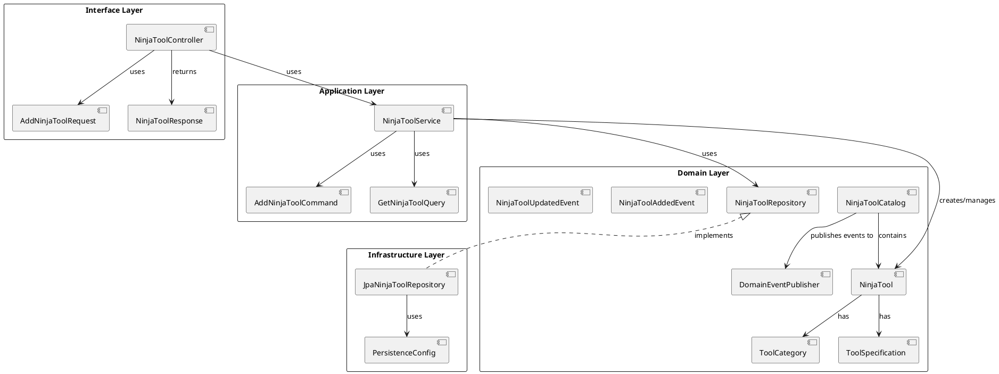

- 今天我們要拿一個實際的案例，來練習使用 DDD (Domain-Driven Design)，設計出一個在 Spring boot 框架上的專案。
- 我盡量把我的思路寫得清楚一點，如果大家看的過程中，有任何覺得可以討論的地方請不吝指教。

## 思路

- 主題是我們要來設計一個在木葉村的忍具店，這個忍具店的主要業務是販售各種忍者用的道具。
- 我們主要的思路流程大致會如下步驟
    1. 需求分析( Requirement Analysis )
    2. 事件風暴（Event Storming）
        1. 領域分析( DDD Domain Analysis )
        2. 定義限界上下文( Bounded Context )
    3. 領域模型設計( DDD Domain Model )
    4. 分層架構設計，按照 DDD 模型的分層架構來設計專案
        1. Interface Layer
        2. Application Layer
        3. Domain Layer
        4. Infrastructure Layer
        5. Anti-corruption Layer 
    5. 實作

## 1. 需求分析

我們的木葉村忍具店系統需要實現以下核心功能：

1. 用戶管理
    用戶註冊和登入
    用戶角色區分（普通忍者、上忍、特殊身份如火影等）
    個人資料管理

2. 商品管理
    忍具分類展示（如武器、防具、卷軸等）
    商品詳細資訊（包括描述、價格、庫存等）
    新品上架和庫存更新

3. 購物功能
    購物車系統
    訂單生成和管理
    支付系統（可能包括現金和特殊的忍者積分）

4. 庫存和供應鏈管理
    實時庫存追踪
    與供應商的接口

以下是我之後有空再擴展的功能：

1. 搜索和過濾
    按類別、價格、忍者等級等搜索商品
    高級過濾選項

2. 評價和評論系統
    用戶可以對購買的忍具進行評分和評論
    評論管理（例如違規評論的處理）

3. 忍具定制服務
    特殊忍具的定制申請
    定制進度跟踪

4. 優惠活動管理
    季節性折扣
    忠誠客戶獎勵計劃

5. 安全和認證系統
    確保只有合法忍者可以購買某些特殊忍具
    防止敵對忍村的滲透

6. 客戶服務
    在線客服聊天
    常見問題解答（FAQ）

7. 忍具使用指南和教學
    視頻教學
    使用技巧分享

8. 數據分析和報告
    銷售趨勢分析
    用戶行為分析

目前我們先以核心功能為主，以下都會以核心功能為主進行設計。

## 2. 事件風暴

- 事件風暴是一種快速的設計方法，通過參與者的參與，將領域知識快速地抽取出來，並且將這些知識轉換成事件、命令、聚合...等，這樣可以幫助團隊快速地理解業務需求，並且快速地設計出領域模型。
- 事件風暴中的名詞解釋
    - Event: 
        事件，系統中發生的事情，通常描述為過去式。即當某個事情發生時，我們可以定義為一個事件，讓這個事件被記錄下來，並且通知其他系統或執行其他操作。
    - Command: 
        命令，用來觸發事件的動作，通常描述為現在或未來式。即當我們要觸發一個事件時，我們可以定義為一個命令，讓這個命令被執行，觸發相應的事件。
    - Aggregate: 
        聚合，代表一個聚合的根，也就是我們軟體中的 Model。通常會貼在 Command、Event 之間。負責處理 Command，發出 Event。      
        當業務對象或實體之間有很強的關聯性時，我們可以將這些實體聚合在一起，形成一個聚合，並且指定一個聚合根，負責維護聚合內部的一致性。通過聚合，我們可以將業務邏輯封裝在一個聚合內部，並且對外提供操作的入口。
    - Policy: 
        策略，定義事件發生後，要自動執行的邏輯或行為。通過策略，我們可以將事件發生後的行為自動化，減少人工干預。例如: 當某忍者註冊成功後，我們可以發送一封郵件給忍者，通知他註冊成功。
    - User: 
        使用者。通常會貼在 Command 上，表示這個命令是由哪個使用者觸發的。可能會是一班用戶、管理員、系統自動執行等。
    - Read Model: 
        閱讀模型。表示使用者當下所看到的資料、畫面。通常會是接在 Event 的後面，表示當某個事件發生後，我們需要更新畫面上的資料。但我個人認為，在 Command 發生之前，我們也可以使用 Read Model，來表示當使用者進行某個操作時，我們需要更新畫面上的資料。
    - User Interface(UI): 
        使用者介面。也就是畫面啦!可以依照 Read Model 簡單先畫出 Wireframe(線框圖)，讓使用者可以看到畫面的樣子。
    - External System: 
        外部系統。當我們的系統需要和其他系統進行交互時，我們可以使用 External System 來表示這個外部系統。
    - Question(可選項): 
        問題。當參與者有任何問題，包含但不限於業務問題、流程問題、技術問題等，都可以提出問題，讓大家一起討論。
    - Hotspot(可選項): 
        熱點。當參與者討論到一個比較複雜或者重要的問題時，可能連參與的領域專家、技術人員都無法解決，抑或是目前所擁有的資訊不足以解決時，我們可以將這個問題標記為熱點，以便之後進一步討論。
    - Opportunity(可選項): 
        機會。表示為本系統可能存在的商機或價值，或是某個流程你覺得很讚，就給他一個讚的意思 :D。

- 通常我們會使用不同顏色的便利貼來區分事件、命令、聚合、策略等，這樣可以幫助我們更好的理解事件風暴的結果。
    - Event 事件: 橘色便利貼
    - Command 命令: 藍色便利貼
    - Aggregate 聚合: 粉紅色便利貼
    - Policy 策略: 綠色便利貼
- 事件風暴的流程
    1. 準備階段
        - 邀請業務專家、開發人員、測試人員、產品經理等參與者參與事件風暴。
        - 準備一個大白板或是一個大畫布、便利貼( 用來寫事件、命令、聚合等 )、筆等工具。
        - 本主題中，我們可以邀請木葉村的忍者、木葉村的商人、木葉村的忍者訓練師、忍具店的店主等參與者參與事件風暴。
    2. 執行階段
        - 我們通常執行的流程會如下
            - Big picture
                1. 開始 Event Storming
                2. 建立 Events ，大家開始貼出自己認為可能會發生的事件
                3. 整理 Events 成有故事性的流程
                4. 走過一次 Events 流程
            - Process Modelling
                1. 依照 Events 流程，建立 Commands
                2. 寫出 Read Model
                3. 劃出 User Interface，Wireframe即可。(我是覺得這個太理想了啦，怎麼可能在會議上就要人家畫出 Wireframe呢)
                4. 在 Events 之後，寫出 Policies，連接 Command。
            - Software Design
                - 依照 Events、Commands、Policies，建立 Aggregates
        1. 識別領域事件
            - 通過參與者的參與，定義出系統中可能會發生的所有事件。
            - 經過整理、補充、討論，最終完善事件列表。
            - 本主題我們以橘色便利貼來標示事件。
            - 用戶管理
                - **用戶註冊完成**：當新用戶成功填寫註冊表單並提交，系統驗證並創建新賬戶後觸發。
                - **用戶登入成功**：用戶輸入正確的憑證並通過系統驗證後觸發。
                - **個人資料已更新**：用戶修改其個人資訊（如聯繫方式、忍術屬性等）並保存後觸發。
                - **用戶登出完成**：用戶主動登出或系統自動登出用戶後觸發。
            - 商品管理
                - **新忍具已添加**：管理員在系統中添加新的忍具產品後觸發。
                - **忍具分類已創建**：管理員創建新的忍具分類（如新型武器類別）後觸發。
                - **忍具分類已更新**：管理員修改現有忍具分類的資訊後觸發。
                - **商品資訊已更新**：管理員修改忍具的詳細資訊（如描述、價格）後觸發。
                - **新品上架完成**：新添加的忍具正式在網站上發布並可供購買時觸發。
                - **庫存數量已更新**：由於銷售、退貨或補貨導致忍具庫存數量變化時觸發。
            - 購物功能
                - **商品已添加到購物車**：用戶選擇一件忍具並將其加入購物車時觸發。
                - **商品已從購物車移除**：用戶從購物車中刪除一件忍具時觸發。
                - **購物車已清空**：用戶選擇清空整個購物車或完成訂單後系統自動清空購物車時觸發。
                - **訂單已創建**：用戶確認購物車中的商品並生成訂單時觸發。
                - **訂單狀態已更新**：訂單狀態發生變化（如待付款、已付款、已發貨等）時觸發。
                - **支付已完成**：用戶成功支付訂單金額後觸發。
            - 庫存和供應鏈管理
                - **庫存水平已達到閾值**：某件忍具的庫存數量降至預設的最低閾值時觸發。
                - **補貨訂單已生成**：系統自動或管理員手動創建向供應商的補貨訂單時觸發。
                - **供應商訂單已確認**：供應商確認接受補貨訂單時觸發。
                - **庫存已補充**：新的忍具庫存到達並更新系統庫存數據時觸發。
        2. 添加命令
            - 在事件的基礎上，說明如何觸發這些事件，定義出系統中可能會發生的所有命令。
            - 在定義命令時，需要識別出哪些人或那些系統可以觸發這些命令。
            - 本主題我們以藍色便利貼來標示命令。
            - 用戶管理
                - 註冊用戶
                - 登錄用戶
                - 登出用戶
                - 更新個人資料
            - 商品管理
                - 添加新忍具
                - 創建忍具分類
                - 更新忍具分類
                - 更新商品資訊
                - 上架新品
                - 更新庫存數量
            - 購物功能
                - 添加商品到購物車
                - 從購物車移除商品
                - 清空購物車
                - 創建訂單
                - 更新訂單狀態
                - 處理支付
            - 庫存和供應鏈管理
                - 檢查庫存水平
                - 生成補貨訂單
                - 確認供應商訂單
                - 補充庫存
        3. 定義策略
            - 策略是指當特定事件發生時，需要自動執行的邏輯或行為。
            - 本主題我們以綠色便利貼來標示策略。
                - 忍者已註冊時，發送郵件通知忍者
                - 當訂單狀態變更為已發貨時，檢查庫存水平
        4. 識別閱讀模型
            - 通過討論，確定系統中可能會發生的所有事件、命令、聚合、策略等之後，將這些事件、命令、聚合、策略等映射到用戶界面上，形成閱讀模型。
            閱讀模型也就是用戶在系統中看到的畫面，畫面上用戶可以看到的所有訊息。
        5. 劃分限界上下文
            - 根據事件風暴的結果，劃分限界上下文，確定各個聚合的邊界。
        6. 識別聚合
            - 定義完 events 和 command，限界上下文也都被劃分清楚了，那麼具在一起的也就是我們識別出的聚合。
            - 聚合分組，根據業務邏輯，將相關的事件和命令分組，形成聚合。
            - 每個聚合都有一個明確的聚合根，這有助於維護數據的一致性和完整性。
            - 聚合的邊界基於業務邏輯和事務一致性需求來劃分，確保相關的實體和值對象在同一個事務邊界內。
            - 這種設計促進了高內聚、低耦合的系統架構，使得每個聚合都能獨立地管理自己的數據和業務規則。
            - 聚合的設計考慮了以上所有的事件和命令，確保每個聚合都能夠處理相應的業務操作。
            - 本主題我們以粉紅色便利貼來標示聚合。
            - 用戶聚合 (User Aggregate)
                - **聚合根**：User
                - **包含的實體/值對象**：UserProfile, UserCredentials
                - **設計思路**：
                - 用戶是系統的核心實體，包含了用戶的基本信息和身份驗證信息。
                - 不包含語言偏好，因為這將通過 HTTP header 動態處理。
                - **支持的命令**：註冊用戶、登錄用戶、更新個人資料。
                    用戶聚合 (User Aggregate)
                - **程式碼**
                    - 聚合根: User
                    ```java
                    @Entity
                    @Table(name = "users")
                    @Getter
                    @Setter
                    @NoArgsConstructor
                    @AllArgsConstructor
                    @Builder
                    public class User {
                        @Id
                        @GeneratedValue(strategy = GenerationType.IDENTITY)
                        private Long id;

                        @Column(unique = true, nullable = false)
                        private String username;

                        @Embedded
                        private UserProfile profile;

                        @Embedded
                        private UserCredentials credentials;
                        
                        public void register(String username, String password, String email) { ... }
                        public void login(String username, String password) { ... }
                        public void updateProfile(UserProfile newProfile) { ... }
                    }
                    ```
                    - 值對象:
                    ```java
                    @Embeddable
                    @Getter
                    @Setter
                    @NoArgsConstructor
                    @AllArgsConstructor
                    @Builder
                    public class UserProfile {
                        @Column(name = "full_name")
                        private String fullName;

                        @Column(unique = true, nullable = false)
                        private String email;

                        @Column(name = "phone_number")
                        private String phoneNumber;

                        @Column(name = "date_of_birth")
                        private LocalDate dateOfBirth;

                        @Column(name = "address")
                        private String address;
                    }

                    @Embeddable
                    @Getter
                    @Setter
                    @NoArgsConstructor
                    @AllArgsConstructor
                    @Builder
                    public class UserCredentials {
                        @Column(name = "hashed_password", nullable = false)
                        private String hashedPassword;

                        @Column(name = "last_login_time")
                        private LocalDateTime lastLoginTime;

                        @Column(name = "random_salt", nullable = false)
                        private String randomSalt;

                    }
                    ```
                    - 設計思路:
                        User 作為聚合根，封裝了用戶的核心信息和行為。
                        UserProfile 和 UserCredentials 作為值對象，分別處理用戶的個人信息和認證信息。
                        方法設計反映了用戶的主要操作，如註冊、登錄、更新資料等。

                - 商品聚合 (Product Aggregate)
                    - **聚合根**：Product
                    - **包含的實體/值對象**：ProductDetails, ProductPrice
                    - **設計思路**：
                        - 商品是系統中的核心實體，包含了商品的基本信息和價格信息。
                    - **支持的命令**：添加商品、更新商品信息、刪除商品。

                - **程式碼**：
                    - 聚合根: Product
                    ```java
                    @Entity // 標記一個類為JPA實體。表示這個類將被映射到 DB 的一個 table。
                    @Table(name = "product") // 指定實體對應的 table 名稱。
                    @Getter
                    @Setter
                    @NoArgsConstructor
                    @AllArgsConstructor
                    @Builder
                    public class Product {
                        @Id // 標記一個屬性為主鍵。也就是這個屬性，將會作為這個 table 的主鍵。
                        @GeneratedValue(strategy = GenerationType.IDENTITY) // 定義主鍵的生成策略。IDENTITY 表示自動增長。
                        private Long id;

                        @Embedded // 標記一個屬性為嵌入式對象。將會看到另外一個 Class 中被標記為 Embeddable。在 DB 中，他們都是在同一個 table 中。但在程式碼中為了提高重用性、可讀性，我們將他們分開為兩個 Class。
                        private ProductDetails details;

                        @Column(nullable = false)
                        private BigDecimal price;

                        @Column(name = "stock_quantity", nullable = false)
                        private int stockQuantity;

                    //    @Column(name = "category_id", nullable = false)
                    //    private Long categoryId;
                        @ManyToOne
                        @JoinColumn(name = "category_id")
                        private ProductCategory category;

                    //    這樣會導致你的 enum 中有幾個參數，就會有幾個 column，我的有 status，還有 statusDescription。
                    //    但我只想要 status，所以改成直接用 String
                    //    @Embedded
                    //    @Enumerated(EnumType.STRING) // 指定枚舉類型的映射策略。這裡使用的是字符串形式。表示雖然我在這邊的型別是枚舉類型，但在 DB 中，它將被映射為字符串形式。
                    //    @Column(nullable = false)
                    //    private ProductStatus productStatus;
                        @Column(nullable = false)
                        private String status;

                    //    @ElementCollection
                    //    @CollectionTable(name = "product_images", joinColumns = @JoinColumn(name = "product_id"))
                        @Column(name = "image_url")
                        private String imageUrl;

                        public void updateDetails(ProductDetails newDetails) { ... }
                        public void updatePrice(BigDecimal newPrice) { ... }
                        public void updateCategoryId(Long newCategoryId) { ... }
                    }
                    ```
                    - 值對象:
                    ```java
                    @Embeddable
                    @Getter
                    @Setter
                    @NoArgsConstructor
                    @AllArgsConstructor
                    @Builder
                    public class ProductDetails {
                        @Column(nullable = false)
                        private String name;

                        @Column(length = 1000)
                        private String description;
                    }

                    @Entity
                    @Table(name = "product_categories")
                    @Getter
                    @Setter
                    @NoArgsConstructor
                    @AllArgsConstructor
                    @Builder
                    public class ProductCategory {
                        @Id
                        @GeneratedValue(strategy = GenerationType.IDENTITY)
                        private Long id;

                        @Column(nullable = false, unique = true)
                        private String name;

                        private String description;
                    }
                    ```
                    - 列舉
                    ```java
                    public enum ProductStatus {
                        PULL_ON_SHELVES("PULL_ON_SHELVES", "上架"),
                        PULL_OFF_SHELVES("PULL_OFF_SHELVES", "下架"),
                        OUT_OF_STOCK("OUT_OF_STOCK", "缺貨"),
                        DISCONTINUED("DISCONTINUED", "停產");

                        private final String status;
                        private final String statusDescription;

                        ProductStatus(String status, String statusDescription) {
                            this.status = status;
                            this.statusDescription = statusDescription;
                        }

                        public String getStatusDescription() {
                            return statusDescription;
                        }
                        public String getStatus() {
                            return status;
                        }
                    }

                    ```
                    - 設計思路:
                        Product 作為聚合根，管理商品的所有相關信息。
                        ProductDetails 和 ProductCategory 作為值對象，提供了商品的詳細信息和分類。
                        方法設計允許更新商品的各個方面，包括詳情、分類、價格和庫存。

            -  購物車聚合 (ShoppingCart Aggregate)

                - **聚合根**：ShoppingCart
                - **包含的實體/值對象**：CartItem
                - **設計思路**：
                - 購物車代表了用戶的臨時購買意圖，需要單獨管理。
                - 將 CartItem 作為 ShoppingCart 的一部分，確保購物車操作的原子性。
                - **支持的命令**：添加商品到購物車、從購物車移除商品、清空購物車。
                - **程式碼**：

                    - 聚合根: ShoppingCart
                    ```java
                    @Entity
                    @Table(name = "shopping_carts")
                    @Getter
                    @Setter
                    @NoArgsConstructor
                    @AllArgsConstructor
                    @Builder
                    public class ShoppingCart {
                        @Id
                        @GeneratedValue(strategy = GenerationType.IDENTITY)
                        private Long id;

                        @Column(name = "user_id", nullable = false)
                        private Long userId;

                        @OneToMany(cascade = CascadeType.ALL, orphanRemoval = true)
                        @JoinColumn(name = "cart_id")
                        private List<CartItem> items = new ArrayList<>();

                        public ShoppingCart(Long userId) {
                            this.userId = userId;
                        }
                        
                        public void addItem(ProductId productId, int quantity) { ... }
                        public void removeItem(ProductId productId) { ... }
                        public void updateItemQuantity(ProductId productId, int newQuantity) { ... }
                        public void clear() { ... }
                    }
                    ```
                    - 值對象:
                    ```java
                    @Entity
                    @Table(name = "cart_items")
                    @Getter
                    @Setter
                    @NoArgsConstructor
                    @AllArgsConstructor
                    @Builder
                    public class CartItem {
                        @Id
                        @GeneratedValue(strategy = GenerationType.IDENTITY)
                        private Long id;

                        @Column(name = "cart_id", nullable = false)
                        private Long cartId;

                    //    @Column(name = "product_id", nullable = false)
                    //    private Long productId;

                        @ManyToOne
                        @JoinColumn(name = "product_id", referencedColumnName = "id")
                        private Product product;

                        @Column(nullable = false)
                        private int quantity;

                        @Column(nullable = false)
                        private BigDecimal price;
                    }
                    ```
                    - 設計思路:
                        ShoppingCart 作為聚合根，管理用戶的購物車內容。
                        CartItem 作為值對象，代表購物車中的單個商品項。
                        方法設計支持添加、移除、更新商品，以及清空購物車等操作。

            -  訂單聚合 (Order Aggregate)

                - **聚合根**：Order
                - **包含的實體/值對象**：OrderItem, OrderStatus, PaymentInfo
                - **設計思路**：
                - 訂單是一個重要的業務概念，代表了一次完整的交易。
                - 將 OrderItem、OrderStatus 和 PaymentInfo 作為 Order 的一部分，確保訂單相關的所有信息在一個事務邊界內。
                - **支持的命令**：創建訂單、更新訂單狀態、處理支付。
                - **程式碼**：
                    - 聚合根: Order
                    ```java
                    @Entity
                    @Table(name = "orders")
                    @Getter @Setter @NoArgsConstructor @AllArgsConstructor @Builder
                    public class Order {
                        @Id
                        @GeneratedValue(strategy = GenerationType.IDENTITY)
                        private Long id;

                        @Column(name = "user_id", nullable = false)
                        private Long userId;

                        @OneToMany(cascade = CascadeType.ALL, orphanRemoval = true)
                        @JoinColumn(name = "order_id")
                        private List<OrderItem> items = new ArrayList<>();

                    //    @Embedded
                    //    @Enumerated(EnumType.STRING) // 指定枚舉類型的映射策略。這裡使用的是字符串形式。表示雖然我在這邊的型別是枚舉類型，但在 DB 中，它將被映射為字符串形式。
                    //    @Column(nullable = false)
                    //    private OrderStatus status;
                        @Column(nullable = false)
                        private String status;

                        @Column(name = "total_amount", nullable = false)
                        private BigDecimal totalAmount;

                        @Embedded
                        private PaymentInfo paymentInfo;
                        
                        public void addItem(ProductId productId, int quantity, Money price) { ... }
                        public void updateStatus(OrderStatus newStatus) { ... }
                        public void processPayment(PaymentInfo paymentInfo) { ... }
                    }
                    ```
                    - 列舉
                    ```java
                    public enum OrderStatus {
                        PENDING("待處理"),
                        PAID("已支付"),
                        SHIPPED("已發貨"),
                        DELIVERED("已送達"),
                        CANCELLED("已取消");

                        private final String statusDescription;

                        OrderStatus(String statusDescription) {
                            this.statusDescription = statusDescription;
                        }

                        public String getStatusDescription() {
                            return statusDescription;
                        }

                        public boolean canCancel() {
                            return this == PENDING || this == PAID;
                        }
                    }
                    ```
                    - 值對象:
                    ```java
                    @Entity
                    @Table(name = "order_items")
                    @Getter @Setter @NoArgsConstructor @AllArgsConstructor @Builder
                    public class OrderItem {
                        @Id
                        @GeneratedValue(strategy = GenerationType.IDENTITY)
                        private Long id;

                        @Column(name = "product_id", nullable = false)
                        private Long productId;

                        @Column(nullable = false)
                        private int quantity;

                        @Column(nullable = false)
                        private BigDecimal price;
                    }

                    @Entity
                    @Table(name = "inventory_items")
                    @Getter @Setter @NoArgsConstructor @AllArgsConstructor @Builder
                    public class InventoryItem {
                        @Id
                        @Column(name = "product_id")
                        private Long productId;

                        @Column(nullable = false)
                        private int quantity;

                        @Column(name = "reorder_threshold", nullable = false)
                        private int reorderThreshold;
                    }

                    @Embeddable
                    @Getter @Setter @NoArgsConstructor @AllArgsConstructor @Builder
                    public class PaymentInfo {
                        @Column(name = "payment_method")
                        private String paymentMethod;

                        @Column(name = "transaction_id")
                        private String transactionId;

                        @Column(name = "payment_time")
                        private LocalDateTime paymentTime;
                    }
                    ```
                    - 設計思路:
                        Order 作為聚合根，封裝了訂單的所有相關信息和狀態。
                        OrderItem、OrderStatus 和 PaymentInfo 作為值對象，分別處理訂單項、訂單狀態和支付信息。
                        方法設計支持添加商品到訂單、更新訂單狀態和處理支付等操作。

                - 這種設計的總體思路是：
                    每個聚合都有一個明確的聚合根，負責維護該聚合的一致性和完整性。
                    值對象用於表示那些沒有獨立身份，但包含重要業務數據的概念。
                    方法設計反映了每個聚合的主要業務操作和規則。
                    在每個根聚合的 ID 也使用一個物件包起來，提高可讀性及擴展性。
                    聚合之間通過 ID 引用，而不是直接關聯，以保持鬆耦合。
                    每個聚合都專注於其核心職責，遵循單一職責原則。
                    這樣的設計有助於創建一個清晰、模塊化且易於維護的領域模型，同時也為未來的擴展和變更提供了良好的基礎。
        7. 優化
            - 通過討論、補充、整理，最終完善事件風暴的結果。
    3. 總結階段
        - 此時，我們的大白板上應該會呈現出一個完成的流程，包含了事件、命令、聚合、策略等。
        - 將事件風暴的結果整理成文檔，並且與參與者確認。
        - 這份文檔將作為我們設計領域模型的參考。

## 3. 環境、後端基礎設置與架構

經過了事件風暴(識別領域事件 -> 添加命令 -> 定義策略 -> 識別閱讀模型 -> 劃分限界上下文 -> 識別聚合 -> 優化)之後，我們已經有了一個清晰的領域模型，甚至是聚合(aggregate)都有了，那麼我們就可以開始設計我們的後端資料夾結構，並把我們的領域模型實現出來。

### 基礎環境

- Java 17
- Spring Boot 3.3.1
- maven
- Dependency:
    - Spring Web
    - Spring Data JPA
    - Lombok
    - h2
    - 後續有需要的再陸續添加
- DB: H2

### application.yml

```yml
spring:
  application:
    name: ninja-ddd-practice
#  h2
  datasource:
    url: jdbc:h2:mem:testdb # in-memory database, database name is testdb
    driver-class-name: org.h2.Driver # H2 driver
    username: sa # default username
    password: password # default password
  h2:
    console:
      enabled: true # enable H2 console, this console can be accessed by http://localhost:8080/h2-console
      path: /h2-console
  jpa:
    hibernate:
      ddl-auto: update
#    ddl- auto has 5 options: none, validate, update, create, create-drop
#    none: 不做任何操作。
#    validate: 驗證 DB schema 是否和 Hibernate 的 Entity schema 一致。如果不一致的話，會丟出一個異常。通常會用於生 production 環境。
#    update: 根據 Hibernate 的 Entity schema 更新 DB schema，這是最常用的選項。但不會刪除既存的資料。
#    create: 根據 Hibernate 的 Entity schema 建立新的 DB schema，這會刪除既存的資料。
#    create-drop: 在 SessionFactory 關閉的時候，刪除 DB schema。通常會用於 test 環境。
    show-sql: true # 當有 SQL 執行時，會在 console 顯示 SQL 語句
    open-in-view: false # 用於延長 Hibernate Session 的生命週期，使其在 View 中仍然有效，避免 LazyInitializationException。但這會導致性能問題，所以建議設置為 false。
    generate-ddl: false # 與 ddl-auto 一樣，但是 ddl-auto 提供了更細的顆粒度控制。hibernate.ddl-auto 通常會覆蓋 spring.jpa.generate-ddl。這裡因為用了 ddl-auto，所以設置為 false。
```

### 資料夾結構

DDD 的資料夾結構大概會分成四個層，另外再加上一個 common 的層，這個 common 的層是用來放一些共用的東西，例如: exception、utils 等等。四個層如下:
- 介面層 (Interfaces Layer)
    - 系統的最外層，負責處理來自外部的請求和回應。
    - 包含的物件：
        - Controllers：處理 HTTP 請求
        - API models：API 特定的請求和回應物件
        - Assemblers/Mappers：在 API 模型和應用層 DTO 之間進行轉換。Assembler 與 Mapper 的效果是一樣的。不過 Assembler 專注於 domain model 和 DTO 之間的轉換，Mapper 則是更廣泛的概念，可以用於任何對象之間的轉換。專案裡面我們就使用 Mapper 就好。
- 應用層 (Application Layer)
    - 協調領域物件以完成特定的應用任務或用例。它不包含業務邏輯，而是委託給領域層。
    - 包含的物件：
        - Application Services：通常是用於處理、協調不同領域物件、不同層之間的操作。不包含業務邏輯。
        - DTOs (Data Transfer Objects)：在應用邊界傳輸資料的物件
        - Commands 和 Queries：表示使用者意圖的物件
        - Event Handlers：處理來自領域層的事件
- 領域層 (Domain Layer)
    - 業務邏輯和類型，是 DDD 的核心。
    - 包含的物件：
        - Aggregates：實體和值物件的集合，維護一致性邊界
            - Aggregate Root：聚合的根實體，負責維護聚合的一致性和完整性。
            - Value Objects：無唯一標識的領域物件
        - Domain Services：真正處理業務邏輯的物件，不屬於任何特定的實體或值物件，保持高內聚、低耦合的特性。
        - Repository Interfaces：定義持久化操作的介面
        - Domain Events：領域中發生的重要事件
- 基礎設施層 (Infrastructure Layer)
    - 提供技術能力，支持其他層的運作。
    - 包含的物件：
        - Repository Implementations：實現領域層定義的儲存庫介面
        - Configurations：Spring 配置類
        - External Service Integrations：與外部服務的整合
        - Utility Classes：通用工具類
- 共享核心 (Shared Kernel) (Optional)
    - 包含在多個限界上下文之間共享的程式碼。或是也可以寫在基礎設施層。
    - 包含的物件：
        - Common Value Objects：共享的值物件
        - Shared Utilities：共享的工具類
        - Cross-cutting Concerns：如日誌、安全等橫切關注點


- 預計我們的資料夾結構會長這樣，Optional 的在專案中如果沒有用到，我就會建立了
```
src
├── main
    ├── java
    │   └── com
    │       └── kai
    │           └── ninja_ddd_practice
    │               ├── applicationLayer
    │               │   ├── commands
    │               │   ├── dtos
    │               │   ├── eventHandlers (Optional)
    │               │   ├── mappers
    │               │   ├── queries (Optional) (將 query 獨立於 command 之外，是為了讓其他更複雜的業務邏輯可以獨立出來，更好維護。)
    │               │   └── services (applicatoin 層中的 service 職責在於協調領域物件，不包含業務邏輯，例如處裡訂單業務，可能會涉及到訂單、商品、用戶等多個領域物件，那麼這個 service 就是用來協調這些物件的。)
    │               ├── domainLayer
    │               │   ├── aggregates
    │               │   │   ├── order
    │               │   │   │   ├── aggregateRoot
    │               │   │   │   │   └── Order.java
    │               │   │   │   └── valueObjects
    |               |   |   |       ├── InventoryItem.java
    │               │   │   │       ├── OrderItem.java
    │               │   │   │       ├── OrderStatus.java
    │               │   │   │       └── PaymentInfo.java 
    │               │   │   ├── product
    │               │   │   │   ├── aggregateRoot
    │               │   │   │   │   └── Product.java
    │               │   │   │   └── valueObjects
    │               │   │   │       ├── ProductDetails.java
    │               │   │   │       ├── ProductPrice.java
    │               │   │   │       └── ProductStatus.java
    │               │   │   ├── productCategory
    │               │   │   │   ├── aggregateRoot
    │               │   │   │   │   └── ProductCategory.java 
    │               │   │   │   └── valueObjects
    │               │   │   │       └── CategoryDetails.java
    │               │   │   ├── shoppingCart
    │               │   │   │   ├── aggregateRoot
    │               │   │   │   │   └── ShoppingCart.java
    │               │   │   │   └── valueObjects
    │               │   │   │       └── CartItem.java
    │               │   │   └── user
    │               │   │       ├── aggregateRoot
    │               │   │       │   └── User.java
    │               │   │       └── valueObjects
    │               │   │           ├── UserProfile.java
    │               │   │           └── UserCredentials.java
    │               │   ├── domainEvents
    │               │   ├── domainServices ( domain 層中的 service 職責在於處理業務邏輯，不屬於任何特定的實體或值物件，保持高內聚、低耦合的特性。)
    │               │   └── repositoryInterfaces
    |               |       ├── OrderRepository.java
    |               |       ├── ProductRepository.java
    |               |       ├── ProductCategoryRepository.java
    |               |       ├── ShoppingCartRepository.java
    |               |       ├── UserRepository.java
    |               |       └── InventoryRepository.java
    │               ├── infrastructureLayer
    │               │   ├── config
    │               │   ├── externalServices
    │               │   ├── repositoryImplementations
    │               │   │   ├── OrderRepositoryImpl.java
    │               │   │   ├── ProductRepositoryImpl.java
    │               │   │   ├── ProductCategoryRepositoryImpl.java
    │               │   │   ├── ShoppingCartRepositoryImpl.java
    │               │   │   ├── UserRepositoryImpl.java
    │               │   │   └── InventoryRepositoryImpl.java
    │               │   └── utilities
    │               └── interfacesLayer
    │                   ├── apiModels
    │                   ├── controllers
    │                   │   ├── OrderController.java
    │                   │   ├── ProductController.java
    │                   │   ├── ProductCategoryController.java
    │                   │   ├── ShoppingCartController.java
    │                   │   ├── UserController.java
    │                   │   ├── InventoryController.java
    │                   └── mappers
    └── resources
        └── application.yml
```

### 忍具管理上下文

- 忍具管理上下文的核心業務是管理忍具的資訊，這邊我們來看一下忍具管理上下文的領域模型。

- Entity:
    - Ninja Tool (忍具): 代表一種忍具，具有違一個標識符。
- Value Object:
    - Tool Category (忍具類別): 代表忍具的類別，例如: 武器、防具、道具等等。
    - Tool Specification (忍具規格): 代表忍具的規格，例如: 長度、重量、材質等等。
- Aggregate:
    - Ninja Tool Catalog (忍具目錄): 以 Ninja Tool 為聚合根(aggregate root)，管理忍具的資訊。
> 根聚合(aggregate root)是一個特殊的實體。      
> 根聚合的設計原則:     
> 1. 根聚合是一個實體，而不是值對象。
> 2. 根聚合是一個聚合的根，是整個聚合的入口。
> 3. 根聚合負責維護聚合內部的一致性，對外提供操作的入口。
> 4. 聚合內部的實體只能通過根聚合進行操作，外部對聚合內部的實體是透明的。
> 5. 根聚合的設計應該符合業務邏輯，而不是數據庫的設計。
> 6. 盡可能將聚合設計保持小巧，指包含緊密相關的實體，減少聚合根之間的相互依賴。
- Domain Event:
    - Ninja Tool Added Event (忍具新增事件): 當新增一個忍具時，發送一個忍具新增事件。
    - Ninja Tool Updated Event (忍具更新事件): 當更新一個忍具時，發送一個忍具更新事件。
- Repository:
    - Ninja Tool Repository (忍具倉庫): 負責管理忍具的資料存取。

## 6. 分層架構設計

- 接下來我們要來設計專案的分層架構，這邊我們會按照 DDD 的分層架構來設計專案。

### Interface Layer

- Interface Layer 是專案的入口，負責接收外部請求，並轉發給 Application Layer 進行處理。
- Controller(REST API): 提供 RESTful API 服務。
- DTO: Data Transfer Object，用來封裝請求和回應的數據。

### Application Layer

- Application Layer 是專案的應用層，負責處理業務邏輯，並調用 Domain Layer 進行業務處理。
- Service: 服務類，負責處理業務邏輯。
- 命令處理器(Command Handler): 負責處理命令。

### Domain Layer

- Domain Layer 是專案的領域層，負責定義領域模型和業務邏輯。
- Entity: 實體類，代表領域模型。
- Value Object: 值對象，代表領域模型中，不需要是唯一標識符的對象。例如: 忍具類別、忍具規格等等。在不同的忍具，可能會有相同的忍具類別或忍具規格。
- Aggregate: 聚合根，代表一個聚合的根，負責維護聚合內部的一致性。
- Domain Event: 領域事件，例如: 忍具新增事件、忍具更新事件就可以定義為領域事件。
- Domain Service: 領域服務，負責處理領域邏輯。例如我們要處理的業務邏輯，就可以定義是領域服務。

### Infrastructure Layer

- Infrastructure Layer 是專案的基礎設施層，負責專案的基礎設施建設。
- Repository: 資料庫的實踐，負責管理領域模型的資料存取。
- Out bound adapter: 外部適配器，負責對外部系統的適配。例如 publish event、send message、third-party API 等等。

### Anti-corruption Layer

- Anti-corruption Layer 是專案的防腐層，為了防止領域模型之間的相互依賴，我們可以使用防腐層來解決。
- 外部系統適配器: 負責對外部系統的適配。

## 7. 實作


1. registration 功能
    1. 使用 @ControllerAdvice 處理全域的異常
    2. 完成註冊功能
2. 製作登入功能
    1. 建立 jwt util
    2. 完成登入功能
    3. 客製 annotation @CurrentUser，用來取得當前登入的使用者
    4. 克制 annotation @ValidateJwt，用來驗證 jwt
    5. 在需要驗證 jwt 的地方使用 @ValidateJwt



